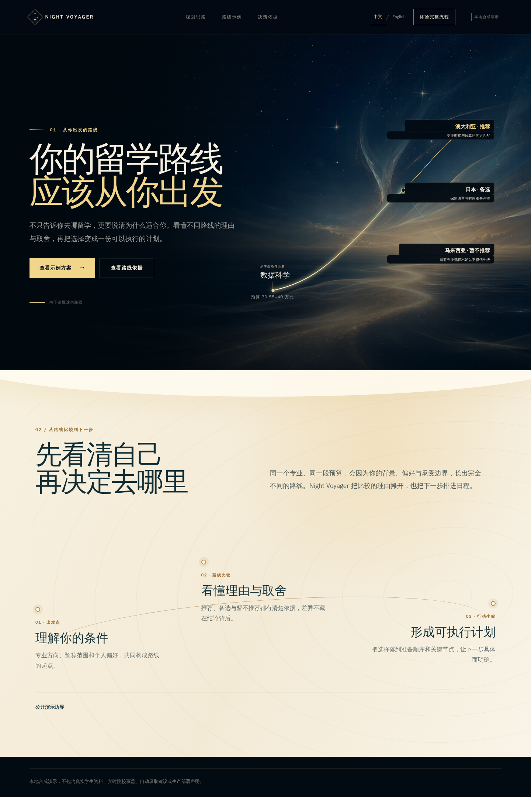
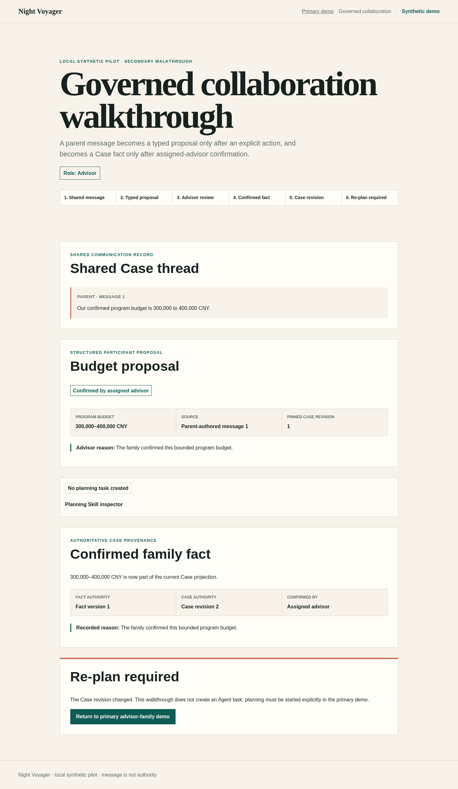

# Night Voyager

Night Voyager turns a synthetic study-abroad comparison into a traceable advisor-to-family decision with durable Agent tasks, explicit human review, and a persisted receipt and timeline. The current post-v0.1.2 development tree opens at `/` with a high-end Chinese-first “Virtual Night Voyage” entry and an explicit persistent English switch. This root is a static, local synthetic, provider-free presentation: it performs no API, session, task, or EventSource work. Runtime imagery uses responsive AVIF and WebP assets; the checked-in source PNG is provenance only.

The complete governed walkthrough begins at `/demo/collaboration` and continues the same Case into explicit planning. The focused advisor-family/evidence route remains at `/demo` and can also be used independently. Both governed demo routes retain the existing warm-paper ledger presentation.






## Engineering proof

- **PostgreSQL and forced RLS:** tenant-scoped runtime roles read and mutate through narrow authority paths backed by the exact `0001 -> 0002 -> 0003 -> 0004 -> 0005 -> 0006 -> 0007 -> 0008 -> 0009` migration graph.
- **Durable task and SSE:** an `AgentTask` survives worker/API restarts, uses bounded leases and generation fencing, and resumes an authorized event stream.
- **Human gates:** deterministic evidence policy, advisor review, and explicit family confirmation remain separate authorities; model or adapter output cannot promote itself.
- **Governed DRA mixed planning:** an optional offline proof imports only `UNTRUSTED_CANDIDATE` rows, keeps assigned-advisor verification and promotion in one atomic database gate, and materializes one governed mixed PlanningRun through the existing durable worker.
- **Governed collaboration authority:** the v0.1.2 release separates shared `MessageEvent` communication, typed `MemoryCandidate` proposals, assigned-advisor verification, and atomic versioned `ConfirmedFact` publication.
- **Versioned Skill runtime:** the v0.1.2 release governs an exact six-key catalog, deterministic evaluation, owner activation/rollback, five-field task/execution pins, and pre-start packaged-registry validation.
- **Browser to database:** `/demo/collaboration` now hands the confirmed same Case to `/demo` without creating a task; the advisor then explicitly starts the real pinned task, SSE, review, parent decision, receipt, and timeline path. The provider-free chain runs in real Chromium against PostgreSQL, while both routes remain independently usable.

## Evaluate the release

Evaluators need Docker Desktop, Docker Compose, and GNU Make:

```bash
make help
make doctor
make demo
make proof
make down
```

Open `http://127.0.0.1:3000/` for the current portfolio entry. It server-renders in exact `zh-CN`; use the labelled `中文` / `English` control to select exact `en`. The presentation-only preference is stored at `night-voyager:presentation-locale:v1` and never enters the session journey, HTTP/BFF requests, task, SSE, or domain authority. For the complete governed walkthrough, follow the [collaboration runbook](docs/operations/collaboration-walkthrough.md) from `/demo/collaboration` into `/demo`. For the focused advisor-family/evidence route, use the [connected demo runbook](docs/operations/connected-demo.md) directly at `/demo`. v0.1.2 remains the latest published release; the new root and other current post-v0.1.2 work are unreleased. The [v0.1.2 release/source-archive verification guide](docs/how-to/verify-v0.1.2-release.md) describes that published release.

For the current same-Case development walkthrough, begin at `/demo/collaboration`,
confirm the synthetic family fact, choose `继续进入受治理规划` (`Continue to governed
planning` in English), and use the explicit task action on `/demo`. The handoff itself
performs read-only validation and creates no task.

`make doctor` checks Docker, Compose capability, local ports, at least 5 GiB on the host project filesystem, and at least 8 GiB on the Docker VM filesystem. Operators may override only the Docker VM threshold with `NIGHT_VOYAGER_DOCKER_MINIMUM_KB`; the check fails closed and never removes Docker resources. `make demo` migrates and seeds a fresh synthetic stack. `make proof` verifies configuration, public hygiene, and an isolated installed wheel without requiring host Python, uv, Node.js, or npm. `make compose-proof` additionally exercises the browser-to-database flow in real Chromium.

## Synthetic and local limits

- v0.1.2 is a local synthetic portfolio release with Governed Collaboration Core v1, deterministic offline governed DRA capability, and the existing advisor-to-family workflow. It is not a production deployment or tenancy claim.
- The repository contains no real student records and makes no admissions outcome, real-user, SLA, availability, or business-impact claim.
- The worker and SSE evidence is deterministic local proof, not distributed high availability.
- Live DRA, OpenClaw, remote providers, messaging, and product-path MKE are not connected. Deterministic offline DRA candidate import and atomic promotion are implemented locally; governed mixed PlanningRun generation is implemented locally through the existing durable worker. Live provider proof was not run and still requires separate authorization. M4B remains an optional read-only compatibility adapter whose projections are `UNTRUSTED_CANDIDATE`.
- Governed collaboration PR A, versioned Skill governance PR B, and browser walkthrough/inspector PR C are released in v0.1.2 as local synthetic capabilities. `/demo/collaboration` itself creates no `AgentTask`; only the explicit action after the same-Case handoff to `/demo` starts the existing governed planning path.
- Post-v0.1.2 PRs 1-3 are merged; the Chinese-first presentation work landed as PR #59. The current high-end root is a later local authority-review change and remains unreleased. It does not change v0.1.2 release records, version, backend authority, or deployment status.

## Milestones and history

- [v0.1.2 release notes](docs/releases/v0.1.2.md)
- [v0.1.1 historical release notes](docs/releases/v0.1.1.md)
- [v0.1.0 historical release notes](docs/releases/v0.1.0.md)
- [Architecture and milestone history](DESIGN.md)
- [Documentation index](docs/README.md)
- [Connected demo storyboard](docs/design/demo-storyboard.md)
- M5 connected advisor-to-family demo: implemented as the local synthetic walkthrough documented in the [runbook](docs/operations/connected-demo.md).
- [M4B optional read-only MKE candidate proof](docs/operations/mke-candidate-proof.md); outputs remain `UNTRUSTED_CANDIDATE`.
- [Governed DRA mixed-evidence proof](docs/operations/dra-consumer-proof.md); candidate import, atomic human promotion, and governed mixed PlanningRun generation are implemented as a deterministic local closure. The connected synthetic `/demo` remains unchanged.
- [Governed collaboration and confirmed-fact reference](docs/reference/collaboration-and-confirmed-facts.md), [authority runbook](docs/operations/collaboration-authority.md), and [browser walkthrough](docs/operations/collaboration-walkthrough.md); PR A and PR C are released in v0.1.2 as authority and presentation layers.
- [Versioned Skills and runtime pins](docs/reference/versioned-skills-and-runtime-pins.md) and [Skill governance runbook](docs/operations/skill-governance.md); PR B is released in v0.1.2, and PR C renders its read-only server projection.
- [Governed fact-to-plan walkthrough](docs/operations/collaboration-walkthrough.md) and [connected continuation](docs/operations/connected-demo.md); the same confirmed Case now reaches explicit deterministic planning locally without a provider.

## Contributor lane

Contributors additionally need Python 3.12.13 managed by [uv](https://docs.astral.sh/uv/), Node.js 24.18.0, and npm:

```bash
make doctor MODE=dev
make check
make db-check
make collaboration-check
make skills-check
make dra-check
make mke-check
```

See [CONTRIBUTING.md](CONTRIBUTING.md) and [SECURITY.md](SECURITY.md). A Chinese version is available in [README_CN.md](README_CN.md).

## License

MIT
