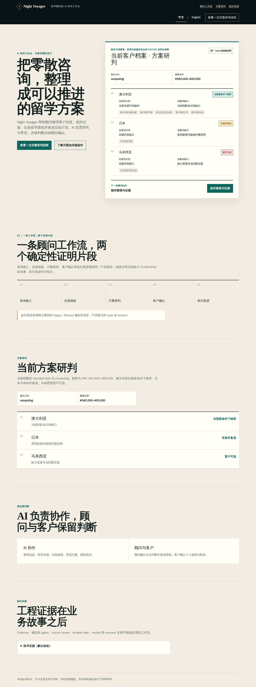
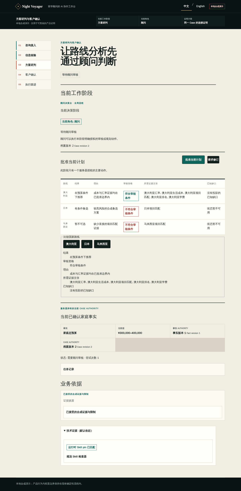
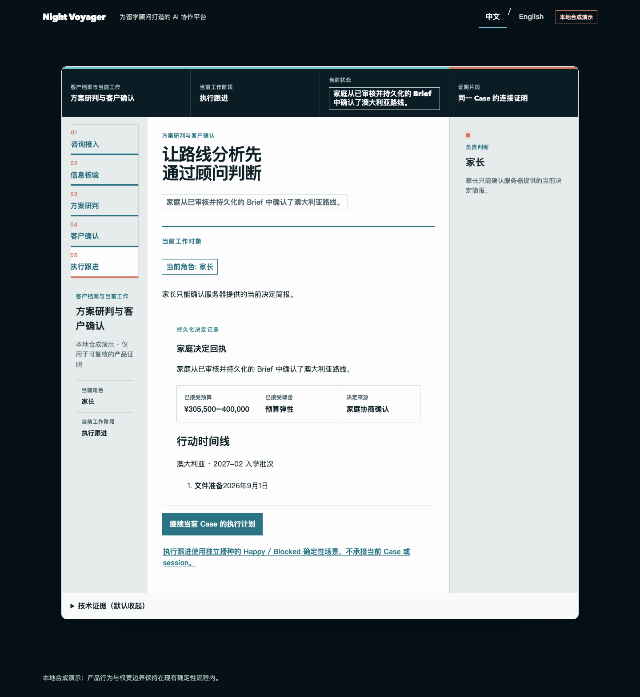
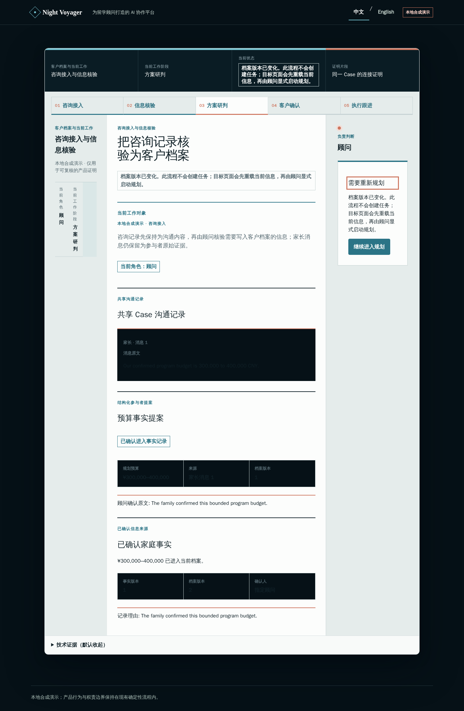
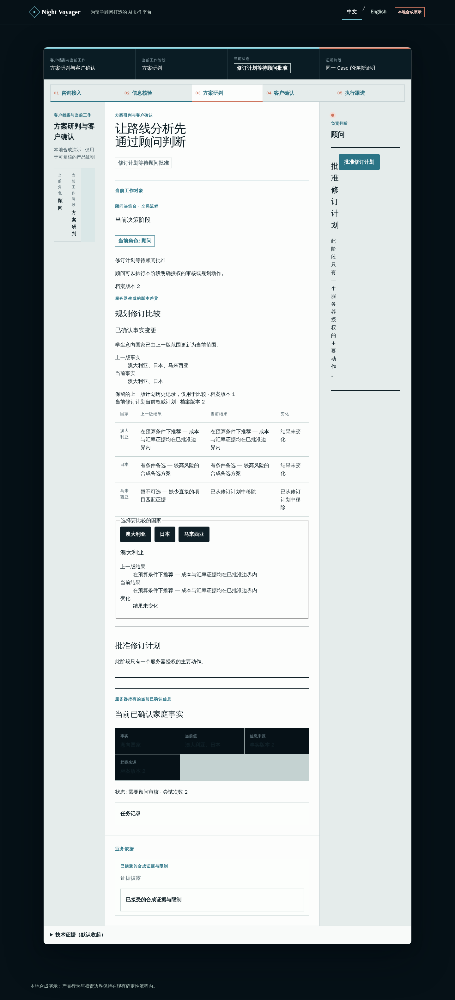

# Night Voyager

Night Voyager turns a synthetic study-abroad comparison into a traceable advisor-to-family decision with durable Agent tasks, explicit human review, and a persisted receipt and timeline. The current v0.1.4 local synthetic portfolio release opens at `/` with a high-end Chinese-first “Virtual Night Voyage” entry and an explicit persistent English switch. This root is a static, local synthetic, provider-free presentation: it performs no API, session, task, or EventSource work. Runtime imagery uses responsive AVIF and WebP assets; the checked-in source PNG is provenance only.

The complete governed walkthrough begins at `/demo/collaboration` and continues the same Case into explicit planning. The focused advisor-family/evidence route remains at `/demo` and can also be used independently. Both governed demo routes retain the existing warm-paper ledger presentation.











Governed plan-execution development evidence (synthetic review evidence only):
[current action](docs/assets/plan-execution-current-action.png),
[advisor review](docs/assets/plan-execution-advisor-review.png),
[mobile reassessment](docs/assets/plan-execution-reassessment-mobile.png), and
[mobile recovery](docs/assets/plan-execution-recovery-mobile.png). Semantic
assertions remain the acceptance authority; screenshots are review evidence.

## Engineering proof

- **PostgreSQL and forced RLS:** tenant-scoped runtime roles read and mutate through narrow authority paths backed by the current development graph `0001 -> 0002 -> 0003 -> 0004 -> 0005 -> 0006 -> 0007 -> 0008 -> 0009 -> 0010 -> 0011 -> 0012 -> 0013 -> 0014 -> 0015`; the released v0.1.4 identity remains fixed at migration `0013`.
- **Durable task and SSE:** an `AgentTask` survives worker/API restarts, uses bounded leases and generation fencing, and resumes an authorized event stream.
- **Human gates:** deterministic evidence policy, advisor review, and explicit family confirmation remain separate authorities; model or adapter output cannot promote itself.
- **Governed DRA mixed planning:** an optional offline proof imports only `UNTRUSTED_CANDIDATE` rows, keeps assigned-advisor verification and promotion in one atomic database gate, and materializes one governed mixed PlanningRun through the existing durable worker. The current provider-free prerequisite pins new strict work to exact post-release commit `01ba21f2996769e68cbc88f4bb0596740df27f6b` and `generic-strict-citation@1`; it is not part of the DRA v0.1.6 release.
- **Governed collaboration authority:** the v0.1.2 release separates shared `MessageEvent` communication, typed `MemoryCandidate` proposals, assigned-advisor verification, and atomic versioned `ConfirmedFact` publication.
- **Versioned Skill runtime:** the v0.1.2 release governs an exact six-key catalog, deterministic evaluation, owner activation/rollback, five-field task/execution pins, and pre-start packaged-registry validation.
- **Explicit fact-to-plan authority:** v0.1.3 migration `0009` makes the first deterministic task creation the atomic `intake -> planning` authority with the pinned task, dispatch, first event, and idempotency result; legacy runtime transition authority stays revoked.
- **Browser to database:** v0.1.3 `/demo/collaboration` hands the confirmed same Case to `/demo` without creating a task; the advisor then explicitly starts the real pinned task, SSE, review, parent decision, receipt, and timeline path. The provider-free chain runs in real Chromium against PostgreSQL, while both routes remain independently usable.
- **Planning revision journey:** v0.1.4 releases provider-free `request revision`, a controlled student preferred-country change, retained predecessor lineage, a successor PlanningRun, deterministic old/new comparison, fresh advisor authorization, and only the current family decision. The blocked budget counterfactual reaches neither approval nor decision.
- **Governed timeline execution:** current development PR A/B/C adds a provider-free `/demo/plan` vertical, closed Happy/Blocked scenarios, structured family attestations, assigned-advisor verification, immutable receipt recovery, PostgreSQL-owned risk/date authority, a reassessment stop, and a bilingual responsive/action-hierarchy proof. It creates no new `AgentTask`, provider call, successor business row, release, or deployment.
- **Portfolio and dependency boundary:** v0.1.4 includes React / Next.js / PostCSS maintenance. Dependabot #8 and #9 are fixed; optional/transitive `sharp` Dependabot #7 remains open at `GHSA-f88m-g3jw-g9cj`, and the full development audit retains the dev-only `brace-expansion` / `minimatch` -> ESLint chain. This is not an audit-zero claim.

## Evaluate the release

Evaluators need Docker Desktop, Docker Compose, and GNU Make:

```bash
make help
make doctor
make demo
make proof
make down
```

Open `http://127.0.0.1:3000/` for the current portfolio entry. It server-renders in exact `zh-CN`; use the labelled `中文` / `English` control to select exact `en`. The presentation-only preference is stored at `night-voyager:presentation-locale:v1` and never enters the session journey, HTTP/BFF requests, task, SSE, or domain authority. For the complete governed walkthrough, follow the [collaboration runbook](docs/operations/collaboration-walkthrough.md) from `/demo/collaboration` into `/demo`. For the focused advisor-family/evidence route, use the [connected demo runbook](docs/operations/connected-demo.md) directly at `/demo`. The [v0.1.4 release/source-archive verification guide](docs/how-to/verify-v0.1.4-release.md) defines the current release gates.

For the current same-Case development walkthrough, begin at `/demo/collaboration`,
confirm the synthetic family fact, choose `继续进入受治理规划` (`Continue to governed
planning` in English), and use the explicit task action on `/demo`. The handoff itself
performs read-only validation and creates no task.

The current focused planning-revision proof uses
`NIGHT_VOYAGER_COMPOSE_PROOF_MODE=planning-revision`. Screenshot maintenance is
explicitly separated: `UPDATE_PORTFOLIO_SCREENSHOTS` retains the released portfolio
captures, while `UPDATE_PLANNING_REVISION_SCREENSHOT` may update only
`night-voyager-planning-revision.png`.

For the current governed execution development path, open `/demo/plan` and follow
the [plan execution walkthrough](docs/operations/plan-execution-walkthrough.md).
PR A/B are merged; PR C is implemented and locally verified. Publication and
v0.1.5 release remain pending, so none of this surface is included in v0.1.4.

`make doctor` checks Docker, Compose capability, local ports, at least 5 GiB on the host project filesystem, and at least 8 GiB on the Docker VM filesystem. Operators may override only the Docker VM threshold with `NIGHT_VOYAGER_DOCKER_MINIMUM_KB`; the check fails closed and never removes Docker resources. `make demo` migrates and seeds a fresh synthetic stack. `make proof` verifies configuration, public hygiene, and an isolated installed wheel without requiring host Python, uv, Node.js, or npm. `make compose-proof` additionally exercises the browser-to-database flow in real Chromium.

## Synthetic and local limits

- v0.1.4 is a local synthetic portfolio release with the prior portfolio workflow plus the Night Voyager-owned governed DRA consumer contract and versioned planning revision authority. It is not a production deployment or tenancy claim.
- The repository contains no real student records and makes no admissions outcome, real-user, SLA, availability, or business-impact claim.
- The worker and SSE evidence is deterministic local proof, not distributed high availability.
- Live DRA, OpenClaw, remote providers, messaging, and product-path MKE are not connected. Deterministic offline DRA candidate import and atomic promotion are implemented locally; governed mixed PlanningRun generation is implemented locally through the existing durable worker. Two separately authorized bounded live attempts returned 25 and 83 same-run Evidence rows, all `uncited`, and both stopped before candidate import. No third provider attempt is authorized; strict live acceptance remains incomplete. M4B remains an optional read-only compatibility adapter whose projections are `UNTRUSTED_CANDIDATE`.
- PR 1, PR 2, and PR 3 of the planning-revision work are released in v0.1.4 as controlled provider-free evidence only. They preserve the failed 25 and 83 row attempts as zero cited rows; strict live acceptance remains incomplete and there is no third provider attempt.
- Governed collaboration PR A, versioned Skill governance PR B, and browser walkthrough/inspector PR C are released in v0.1.2 as local synthetic capabilities. `/demo/collaboration` itself creates no `AgentTask`; only the explicit action after the same-Case handoff to `/demo` starts the existing governed planning path.
- The v0.1.4 release does not add live providers, production deployment, distributed HA, SLA, real student data, real school coverage, advisor-team adoption, or admissions outcomes.
- Governed timeline-execution PR A/B/C is current local development only.
  Publication and v0.1.5 release remain pending; no release, deployment, live
  provider, real-user, or outcome claim is made.

## Milestones and history

- [v0.1.4 release notes](docs/releases/v0.1.4.md)
- [v0.1.3 historical release notes](docs/releases/v0.1.3.md)
- [v0.1.2 historical release notes](docs/releases/v0.1.2.md)
- [v0.1.1 historical release notes](docs/releases/v0.1.1.md)
- [v0.1.0 historical release notes](docs/releases/v0.1.0.md)
- [Architecture and milestone history](DESIGN.md)
- [Documentation index](docs/README.md)
- [Connected demo storyboard](docs/design/demo-storyboard.md)
- M5 connected advisor-to-family demo: implemented as the local synthetic walkthrough documented in the [runbook](docs/operations/connected-demo.md).
- [M4B optional read-only MKE candidate proof](docs/operations/mke-candidate-proof.md); outputs remain `UNTRUSTED_CANDIDATE`.
- [Governed DRA mixed-evidence proof](docs/operations/dra-consumer-proof.md); candidate import, atomic human promotion, and governed mixed PlanningRun generation are implemented as a deterministic local closure. The connected synthetic `/demo` remains unchanged.
- [Governed collaboration and confirmed-fact reference](docs/reference/collaboration-and-confirmed-facts.md), [authority runbook](docs/operations/collaboration-authority.md), and [browser walkthrough](docs/operations/collaboration-walkthrough.md); PR A and PR C are released in v0.1.2 as authority and presentation layers.
- [Versioned Skills and runtime pins](docs/reference/versioned-skills-and-runtime-pins.md) and [Skill governance runbook](docs/operations/skill-governance.md); PR B is released in v0.1.2, and PR C renders its read-only server projection.
- [Governed fact-to-plan walkthrough](docs/operations/collaboration-walkthrough.md) and [connected continuation](docs/operations/connected-demo.md); the same confirmed Case now reaches explicit deterministic planning locally without a provider.

## Contributor lane

Contributors additionally need Python 3.12.13 managed by [uv](https://docs.astral.sh/uv/), Node.js 24.18.0, and npm:

```bash
make doctor MODE=dev
make check
make db-check
make collaboration-check
make skills-check
make dra-check
make mke-check
```

See [CONTRIBUTING.md](CONTRIBUTING.md) and [SECURITY.md](SECURITY.md). A Chinese version is available in [README_CN.md](README_CN.md).

## License

MIT
