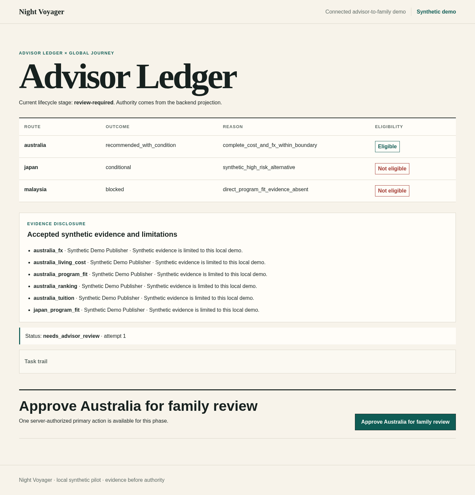
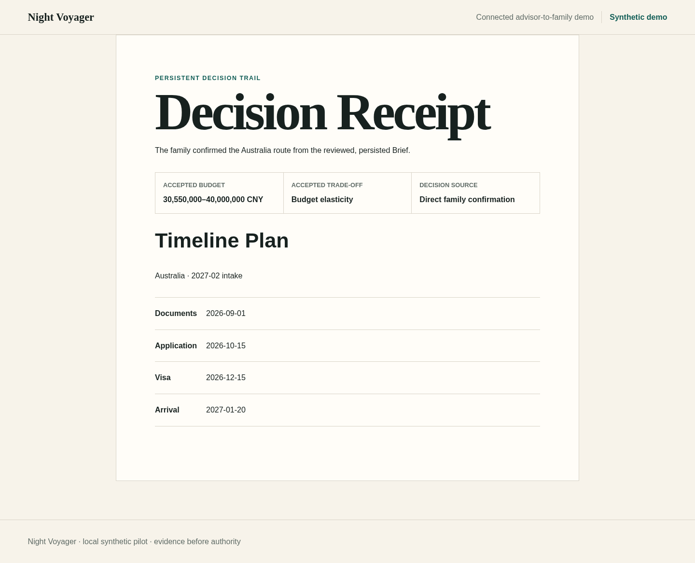

# Night Voyager

Night Voyager 将一组三国留学比较转化为可追溯的 advisor-to-family decision：以 durable Agent task 执行流程，经过明确的人工复核，并持久化 decision receipt 与 timeline。





## 工程证据

- **PostgreSQL 与 forced RLS：** tenant-scoped runtime role 通过狭窄 authority path 读写，migration graph 固定为 `0001 -> 0002 -> 0003 -> 0004 -> 0005 -> 0006 -> 0007`。
- **Durable task 与 SSE：** `AgentTask` 可跨 worker/API restart 保持，使用 bounded lease 与 generation fencing，并恢复授权 event stream。
- **Human gates：** deterministic evidence policy、advisor review 与显式 family confirmation 相互分离；模型或 adapter 输出不能自行获得 promotion authority。
- **Governed DRA mixed planning：** optional offline proof 只导入 `UNTRUSTED_CANDIDATE`；assigned-advisor verification 与 promotion 共用一个原子数据库 gate，并通过既有 durable worker 物化一个 governed mixed PlanningRun。
- **Governed collaboration authority：** unreleased backend boundary 将共享 `MessageEvent` communication、typed `MemoryCandidate` proposal、assigned-advisor verification 与 atomic versioned `ConfirmedFact` publication 分离。
- **Browser to database：** connected `/demo` 在 Chromium 中执行真实 Next.js BFF、FastAPI、worker、SSE 与 PostgreSQL synthetic flow。

## 验证 release

Evaluator 只需要 Docker Desktop、Docker Compose 与 GNU Make：

```bash
make help
make doctor
make demo
make proof
make down
```

connected local synthetic demo 位于 `http://127.0.0.1:3000/demo`。按 [connected demo runbook](docs/operations/connected-demo.md)完成 advisor-to-family walkthrough；发布后使用 [v0.1.1 release/source-archive verification guide](docs/how-to/verify-v0.1.1-release.md)核对 public artifact。

`make doctor` 检查 Docker、Compose capability、磁盘空间与本地端口。`make demo` 迁移并 seed fresh synthetic stack。`make proof` 验证配置、public hygiene 与隔离 installed wheel，不要求 host Python、uv、Node.js 或 npm。`make compose-proof` 还会在真实 Chromium 中执行 browser-to-database flow。

## 合成与本地边界

- v0.1.1 是 local synthetic portfolio release，新增 deterministic offline governed DRA candidate import、atomic human verification/promotion，以及通过 existing durable worker 执行的 mixed PlanningRun generation；不代表 production deployment 或 production tenancy。
- 仓库不包含真实学生记录，也不宣称录取结果、真实用户、SLA、可用性或业务收益。
- worker 与 SSE 仅提供 deterministic local proof，不代表 distributed high availability。
- Live DRA、OpenClaw、remote provider、消息通道与 product-path MKE 均未连接。Deterministic offline DRA candidate import、atomic promotion 与 governed mixed PlanningRun generation 已在本地实现；live provider proof 未运行，仍需单独授权。M4B 仍是 optional read-only compatibility adapter，所有投影保持 `UNTRUSTED_CANDIDATE`。
- Governed collaboration PR A 是 unreleased local synthetic backend capability。PR B Skill governance 与 PR C `/demo/collaboration` browser walkthrough 尚未实现；既有 `/demo` route 与 frontend 保持不变。

## Milestone 与历史

- [v0.1.1 release notes](docs/releases/v0.1.1.md)
- [v0.1.0 历史 release notes](docs/releases/v0.1.0.md)
- [架构与 milestone 历史](DESIGN.md)
- [文档索引](docs/README.md)
- [历史 M1 fixture-only visual contract](docs/superpowers/specs/2026-07-11-m1-demo-design.md)
- M5 connected advisor-to-family demo 已实现为 [runbook](docs/operations/connected-demo.md)所述的 local synthetic walkthrough。
- [M4B optional read-only MKE candidate proof](docs/operations/mke-candidate-proof.md)；输出保持 `UNTRUSTED_CANDIDATE`。
- [Governed DRA mixed-evidence proof](docs/operations/dra-consumer-proof.md)；candidate import、atomic human promotion 与 governed mixed PlanningRun generation 已形成 deterministic local closure，connected synthetic `/demo` 保持不变。
- [Governed collaboration 与 confirmed-fact reference](docs/reference/collaboration-and-confirmed-facts.md)及 [authority runbook](docs/operations/collaboration-authority.md)；PR A 已实现为 unreleased backend boundary，PR B 与 PR C 仍 deferred。

## Contributor 路径

Contributor 还需要由 [uv](https://docs.astral.sh/uv/) 管理的 Python 3.12.13、Node.js 24.18.0 与 npm：

```bash
make doctor MODE=dev
make check
make db-check
make collaboration-check
make dra-check
make mke-check
```

更多信息见 [CONTRIBUTING.md](CONTRIBUTING.md) 与 [SECURITY.md](SECURITY.md)。

## License

MIT
