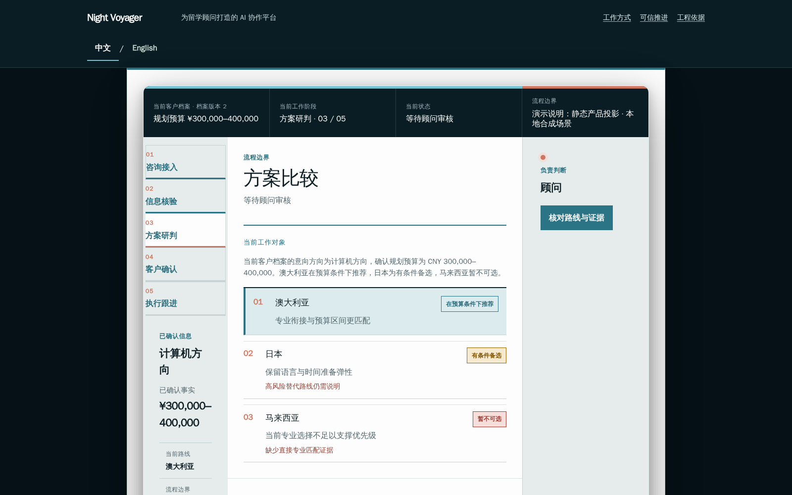
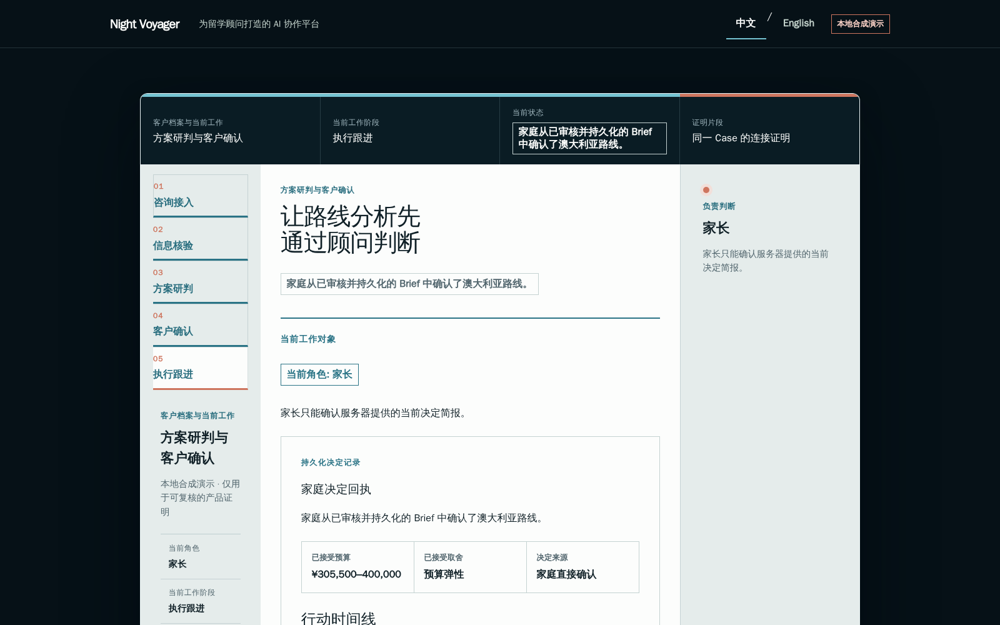
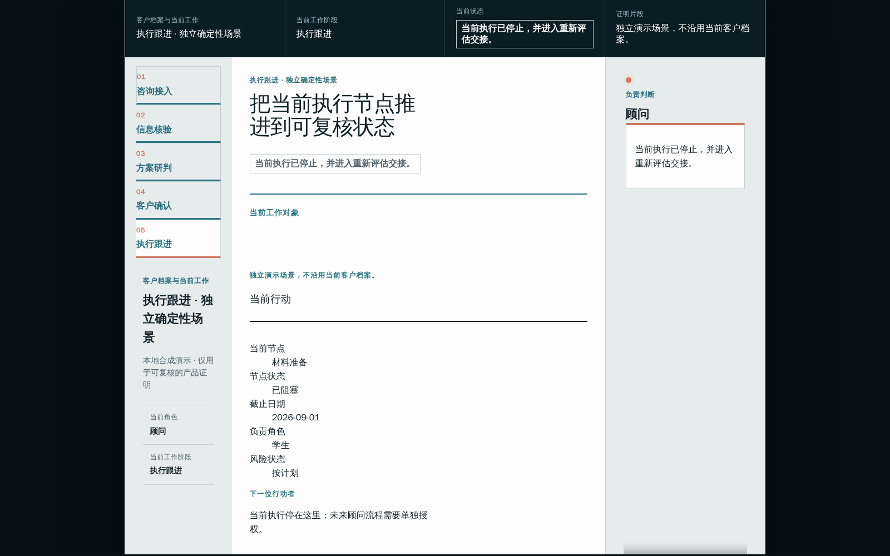
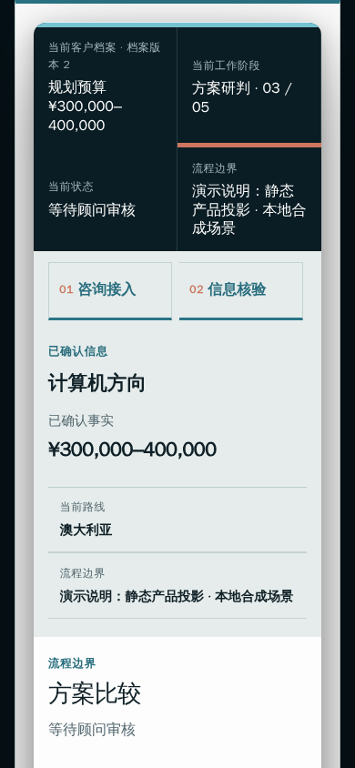

# Night Voyager

Night Voyager 帮助留学顾问把已确认事实整理成从路线比较到客户决定的清晰、可复核路径。

## 顾问工作台概览



这张真实 Chromium 截图展示当前基于本地合成数据的顾问工作台。它是该演示的评审证据，不代表生产环境或录取结果。[展示清单](docs/evidence/advisor-showcase-manifest.json) 记录四张标准展示图的来源版本、页面状态、图像尺寸和 SHA-256。

## 目标用户与真实问题

Night Voyager 面向留学顾问团队，支持他们与参与确认的学生和家长共同比较日本、马来西亚和澳大利亚。真实问题不是再生成一条无法追溯的推荐，而是在事实、偏好、时间或预算变化时，让所有人都能看清哪些内容已确认、考虑过哪些路线、谁需要作出决定，以及如何安全恢复。

## 五阶段工作流

1. **确认事实：** 将已确认事实与对话草稿、待核实假设分开。
2. **比较路线：** 后续规划只使用明确确认的事实，按个案约束比较具备条件的路线。
3. **顾问审核：** 由顾问批准、修改或停止拟议方案。
4. **客户确认：** 保留客户的责任和明确选择。
5. **记录结果：** 保留可供后续查看的决策回执与行动时间线。

## 正常路径与阻塞恢复



正常帧展示同一咨询个案路径：从路线研判经过顾问审核和客户确认，最终形成持久化决策回执与行动时间线。



阻塞帧展示一个单独设置的确定性执行场景：当方案前提或预算发生变化，导致检查点受阻时，工作流回到顾问重新评估或安全停止。它不表示前一咨询个案会延续到这个独立场景，也不代表生产结果。



移动帧展示同一个真实路线研判工作台在标准 390x844 视口下的呈现。四张展示图对应概览、正常路径、阻塞恢复和移动端视图。

## 三个产品判断

- **事实先于规划：** 已确认事实与对话草稿分开保存；后续规划只使用明确确认的事实。
- **建议不能替代责任：** 智能助手可以分析并提出建议，但承担责任的决定和行动仍由顾问与客户负责，不能由模型代替。
- **变化时保留恢复入口：** 当方案前提发生变化或执行受阻时，保留版本、回执和恢复入口，不沿用过期状态继续执行。

## 快速开始、架构与发布

- **快速开始：** 运行 `make help`、`make doctor`、`make demo` 与 `make proof`，然后打开 `http://127.0.0.1:3000/`。
- **架构：** 阅读 [架构与里程碑历史](DESIGN.md) 与 [文档索引](docs/README.md)。
- **发布：** [v0.1.5 发布说明](docs/releases/v0.1.5.md) 与 [v0.1.5 发布验证指南](docs/how-to/verify-v0.1.5-release.md) 说明当前发布基线；本展示层仅用于呈现，不改变发布状态。

## 详细证明

当前 runtime、contracts、authority boundaries 与 release evidence 继续保留在下方。历史视觉资产仍用于 proof 与 context，但不再作为 README 首层画廊。

当前 development candidate 仍是面向留学顾问的 AI 协作平台。当前 development candidate 展示 reference-driven advisor-centered root 与三个 demo route 共享的 workspace shell，属于静态（static）、local synthetic、provider-free presentation evidence，仍未发布或部署。稳定的 v0.1.5 仍是此前的 local synthetic portfolio release。这个 root 不发起 API、session、task 或 EventSource。

完整 governed walkthrough 从 `/demo/collaboration` 开始，经 `/demo` 继续同一 Case；同一 Case 的连接证明在 receipt 与 TimelinePlan 处结束。`/demo/plan` 是独立播种的 Happy / Blocked 确定性执行场景，不承接连接证明中的 Case 或 session。截图是评审证据，不是功能权威；semantic assertions 才是 acceptance authority。

<details>
<summary>历史视觉证明截图</summary>


Governed plan-execution development evidence（仅 synthetic review evidence）：[current action](docs/assets/plan-execution-current-action.png)、[advisor review](docs/assets/plan-execution-advisor-review.png)、[mobile reassessment](docs/assets/plan-execution-reassessment-mobile.png) 与 [mobile recovery](docs/assets/plan-execution-recovery-mobile.png)。Semantic assertions 才是 acceptance authority；截图是评审证据，不是功能权威。

</details>

## 工程证据

- **PostgreSQL 与 forced RLS：** tenant-scoped runtime role 通过狭窄 authority path 读写；released graph 为 `0001 -> 0002 -> 0003 -> 0004 -> 0005 -> 0006 -> 0007 -> 0008 -> 0009 -> 0010 -> 0011 -> 0012 -> 0013 -> 0014 -> 0015`，v0.1.5 identity 固定在 migration `0015`。
- **Durable task 与 SSE：** `AgentTask` 可跨 worker/API restart 保持，使用 bounded lease 与 generation fencing，并恢复授权 event stream。
- **Human gates：** deterministic evidence policy、advisor review 与显式 family confirmation 相互分离；模型或 adapter 输出不能自行获得 promotion authority。
- **Governed DRA mixed planning：** optional offline proof 只导入 `UNTRUSTED_CANDIDATE`；assigned-advisor verification 与 promotion 共用一个原子数据库 gate，并通过既有 durable worker 物化一个 governed mixed PlanningRun。当前 provider-free prerequisite 将 strict new work 固定到 exact post-release commit `01ba21f2996769e68cbc88f4bb0596740df27f6b` 与 `generic-strict-citation@1`；它不属于 DRA v0.1.6 release。
- **Governed collaboration authority：** v0.1.2 release 将共享 `MessageEvent` communication、typed `MemoryCandidate` proposal、assigned-advisor verification 与 atomic versioned `ConfirmedFact` publication 分离。
- **Versioned Skill runtime：** v0.1.2 release 治理 exact six-key catalog、deterministic evaluation、owner activation/rollback、five-field task/execution pin，以及 start 前的 packaged-registry validation。
- **Explicit fact-to-plan authority：** v0.1.3 migration `0009` 把 first deterministic task creation 固定为 atomic `intake -> planning` authority，并在同一 transaction 写入 pinned task、dispatch、first event 与 idempotency result；legacy runtime transition authority 继续被撤回。
- **Browser to database：** v0.1.3 `/demo/collaboration` 现在可在不创建 task 的情况下，把已确认的同一 Case 交给 `/demo`；advisor 随后显式启动真实 pinned task、SSE、review、parent decision、receipt 与 timeline 路径。整条 provider-free chain 在真实 Chromium 与 PostgreSQL 上运行，同时两个 route 仍可独立使用。
- **Planning revision journey：** v0.1.4 发布 provider-free `request revision`、controlled student preferred-country change、retained predecessor lineage、successor PlanningRun、deterministic old/new comparison、fresh advisor authorization，以及 only the current family decision。blocked budget counterfactual 不会到达 approval 或 decision。
- **Governed timeline execution：** v0.1.5 发布 provider-free `/demo/plan` vertical、closed Happy/Blocked scenario、structured family attestation、assigned-advisor verification、immutable receipt recovery、PostgreSQL-owned risk/date authority、reassessment stop，以及 bilingual responsive/action-hierarchy proof；不创建新 `AgentTask`、provider call、successor business row 或 deployment。
- **Portfolio 与 dependency boundary：** v0.1.5 包含 PR #78 合并的 frontend dependency maintenance。当前 development 已使用 Next.js 与 `eslint-config-next` `16.3.0`；Next.js resolves optional/transitive `sharp 0.35.3`，位于 `GHSA-f88m-g3jw-g9cj` advisory range 外，并使用 `postcss@8.5.23` 与兼容的 transitive `nanoid@3.3.18`。仓库没有 direct `sharp`、`postcss` 或 `nanoid` dependency，也没有 override。不可变的 v0.1.5 release 不是 audit-zero claim；这段 current-development wording 不改写其 historical release evidence。Fresh full 与 runtime/omit-dev npm audits 均报告 zero advisory objects，且没有 sharp advisory object。Dependabot #7 hosted alert status is evaluated after merge；本地变更不作 hosted alert claim。Recovery triggers 仍仅为 public deployment、untrusted image path 或 advisory change。
- **Complementary-evidence Slice 0 status：** Slice 0 已永久以 local `evaluation_invalid` safe stop 结束。它没有 `MkeCaptureArtifactV2`、Slice 0 terminal receipt、information-gain conclusion、candidate persistence、Slice 1/2 work 或 v0.1.6 release。PR #87 已 merged；hosted CI 与 publication cleanup 已完成，且没有解锁后续阶段。

## 验证 release

Evaluator 只需要 Docker Desktop、Docker Compose 与 GNU Make：

```bash
make help
make doctor
make demo
make proof
make down
```

当前 advisor workspace 入口位于 `http://127.0.0.1:3000/`，SSR 使用 exact `zh-CN`；页头 `中文` / `English` 控件可显式选择 exact `en`。仅展示使用的 preference key 是 `night-voyager:presentation-locale:v1`，不会进入 session journey、HTTP/BFF request、task、SSE 或 domain authority。连接证明按 [collaboration runbook](docs/operations/collaboration-walkthrough.md)从 `/demo/collaboration` 进入 `/demo`；独立执行场景按 [plan execution walkthrough](docs/operations/plan-execution-walkthrough.md)访问 `/demo/plan`。[v0.1.5 release/source-archive verification guide](docs/how-to/verify-v0.1.5-release.md)定义 current release gates。

如需验证当前 same-Case development walkthrough，请从
`/demo/collaboration` 开始，确认 synthetic family fact，选择
`继续进入规划`（English 为 `Continue to planning`），再在 `/demo` 执行显式 task action。Handoff
本身只做 read-only validation，creates no task。

当前 focused planning-revision proof 使用
`NIGHT_VOYAGER_COMPOSE_PROOF_MODE=planning-revision`。Screenshot 维护显式隔离：
`UPDATE_PORTFOLIO_SCREENSHOTS` 更新当前 development-candidate portfolio captures，
`UPDATE_PLANNING_REVISION_SCREENSHOT` 只能更新
`night-voyager-planning-revision.png`。

v0.1.5 发布的 governed execution path 位于 `/demo/plan`，操作步骤见
[plan execution walkthrough](docs/operations/plan-execution-walkthrough.md)。
PR #80、PR #83、PR #84 与 PR #85 均已合并并纳入已发布的 v0.1.5；release
包含 governed authority、recovery/reassessment closure、reconciliation，以及
professional presentation/evaluator-first DX。PR #87 已 merged；其 hosted CI 与
publication cleanup 已完成。

`make doctor` 检查 Docker、Compose capability、本地端口、host project filesystem 至少 5 GiB，以及 Docker VM filesystem 至少 8 GiB。运维人员只能通过 `NIGHT_VOYAGER_DOCKER_MINIMUM_KB` 调整 Docker VM 门槛；检查会 fail closed，且绝不会自动删除 Docker 资源。`make demo` 迁移并 seed fresh synthetic stack。`make proof` 验证配置、public hygiene 与隔离 installed wheel，不要求 host Python、uv、Node.js 或 npm。`make compose-proof` 还会在真实 Chromium 中执行 browser-to-database flow。

## 合成与本地边界

- v0.1.5 是 local synthetic portfolio release，在既有 portfolio workflow 上发布 governed timeline execution、recovery/reassessment authority、reconciliation 与 professional evaluator-facing presentation；不代表 production deployment 或 production tenancy。
- 仓库不包含真实学生记录，也不宣称录取结果、真实用户、SLA、可用性或业务收益。
- worker 与 SSE 仅提供 deterministic local proof，不代表 distributed high availability。
- Live DRA、OpenClaw、remote provider、消息通道与 product-path MKE 均未连接。Deterministic offline DRA candidate import、atomic promotion 与 governed mixed PlanningRun generation 已在本地实现。两次分别授权的 bounded live attempt 返回了 25 与 83 条 same-run Evidence，全部为 `uncited`，并都在 candidate import 前停止。第三次 provider attempt 未获授权；strict live acceptance 仍不完整。M4B 仍是 optional read-only compatibility adapter，所有投影保持 `UNTRUSTED_CANDIDATE`。
- Planning-revision PR 1、PR 2、PR 3 已在 v0.1.4 作为 controlled provider-free evidence 发布。它保留 25 and 83 row 失败尝试为 zero cited rows；strict live acceptance remains incomplete，且 no third provider attempt。
- Governed collaboration PR A、versioned Skill governance PR B 与 browser walkthrough/inspector PR C 已在 v0.1.2 作为 local synthetic capability 发布。`/demo/collaboration` 本身不创建 `AgentTask`；只有 same-Case handoff 后在 `/demo` 执行显式 action，才会启动既有 governed planning path。
- v0.1.5 不新增 live provider、production deployment、distributed HA、SLA、真实学生数据、真实学校覆盖、顾问团队采用、录取结果或 business-benefit claim。
- Governed timeline-execution PR A/B/C 只作为 local synthetic、provider-free
  evidence 发布；不宣称 deployment、live provider、real user 或 outcome。

## Milestone 与历史

- [v0.1.5 release notes](docs/releases/v0.1.5.md)
- [v0.1.4 historical release notes](docs/releases/v0.1.4.md)
- [v0.1.3 历史 release notes](docs/releases/v0.1.3.md)
- [v0.1.2 历史 release notes](docs/releases/v0.1.2.md)
- [v0.1.1 历史 release notes](docs/releases/v0.1.1.md)
- [v0.1.0 历史 release notes](docs/releases/v0.1.0.md)
- [架构与 milestone 历史](DESIGN.md)
- [文档索引](docs/README.md)
- [Connected demo storyboard](docs/design/demo-storyboard.md)
- M5 connected advisor-to-family demo 已实现为 [runbook](docs/operations/connected-demo.md)所述的 local synthetic walkthrough。
- [M4B optional read-only MKE candidate proof](docs/operations/mke-candidate-proof.md)；输出保持 `UNTRUSTED_CANDIDATE`。
- [Governed DRA mixed-evidence proof](docs/operations/dra-consumer-proof.md)；candidate import、atomic human promotion 与 governed mixed PlanningRun generation 已形成 deterministic local closure，connected synthetic `/demo` 保持不变。
- [Governed collaboration 与 confirmed-fact reference](docs/reference/collaboration-and-confirmed-facts.md)、[authority runbook](docs/operations/collaboration-authority.md)及 [browser walkthrough](docs/operations/collaboration-walkthrough.md)；PR A 与 PR C 已在 v0.1.2 作为 authority 与 presentation layer 发布。
- [Versioned Skills 与 runtime pins](docs/reference/versioned-skills-and-runtime-pins.md)及 [Skill governance runbook](docs/operations/skill-governance.md)；PR B 已在 v0.1.2 发布，PR C 已实现其 read-only server projection。
- [Governed fact-to-plan walkthrough](docs/operations/collaboration-walkthrough.md)与 [connected continuation](docs/operations/connected-demo.md)；同一 confirmed Case 现在可在本地进入显式 deterministic planning，且不依赖 provider。

## Contributor 路径

Contributor 还需要由 [uv](https://docs.astral.sh/uv/) 管理的 Python 3.12.13、Node.js 24.18.0 与 npm：

```bash
make doctor MODE=dev
make check
make db-check
make collaboration-check
make skills-check
make dra-check
make mke-check
```

更多信息见 [CONTRIBUTING.md](CONTRIBUTING.md) 与 [SECURITY.md](SECURITY.md)。

## License

MIT
