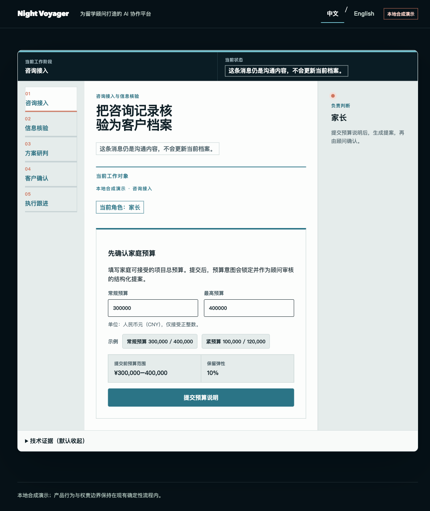

# Governed collaboration walkthrough

The connected same-Case proof begins at `/demo/collaboration`. This local synthetic
advisor workspace shows how a client consultation record becomes an authoritative
Case fact only after assigned advisor confirmation, then hands the same Case to
route analysis at `/demo`. After the family decision, the primary action continues
the same Case into `/demo/plan?case_id=<case_id>` and the existing execution flow;
bare `/demo/plan` is a separate deterministic execution scenario. It is
non-production proof, not messaging, admissions advice, or a claim about real users.

The route server-renders exact `zh-CN`; the shared header can explicitly persist
exact `en` at `night-voyager:presentation-locale:v1`. Locale is presentation-only and
cannot alter the journey envelope, authority reads, idempotency, role rotation,
navigation, task count, or EventSource count/URL.

The current presentation authority is the [reference-driven presentation spec](../superpowers/specs/2026-08-14-reference-driven-presentation.md) and [implementation plan](../superpowers/plans/2026-08-14-reference-driven-presentation.md). The shared frame and five-stage rail are display-only; the route retains existing business and server authority.




## Run the walkthrough

```bash
make demo
```

Open `http://127.0.0.1:3000/demo/collaboration` and follow the eight visible stages:

1. Start the parent walkthrough and enter the preferred and hard-ceiling total
   program budgets as positive whole CNY amounts. The default example is
   `300,000` / `400,000`; the compact `紧预算` (`Tight budget`) example is
   `100,000` / `120,000`. Local validation rejects blank, decimal, exponent,
   negative, zero, out-of-range, and preferred-above-ceiling inputs before any
   request is sent.
2. Explicitly turn that message into a typed parent proposal.
3. Reload the pending candidate, then use the real role switch: revoke the parent
   session and mint the assigned advisor session.
4. Record the advisor confirmation. A message or proposal alone is never authority.
5. Reload the confirmed fact and Case revision from PostgreSQL authority.
6. At `需要重新规划` (`Re-plan required`), choose `继续进入规划`
   (`Continue to planning`). The route
   revalidates the current candidate, confirmed fact, Case revision, advisor ledger,
   and Skill inspector, then replaces the same-tab envelope and navigates once.
7. On `/demo`, confirm the continued same Case and revision, then use the explicit
   task action to start planning.
8. After the family decision reaches `plan_ready`, choose `继续当前 Case 的执行计划`
   (`Continue this Case into execution` in English). The route carries only the
   current `case_id`; the execution context, receipt, timeline, role, and optional
   execution are re-derived by the server.

The handoff sends zero task POST requests, creates no `AgentTask`, and opens no
`EventSource`; the collaboration route does not use polling. It keeps the same
opaque advisor cookie, CSRF value, and Case; it
does not bootstrap, mint, revoke, or perform a client-only identity change. A
successful handoff performs one exact closed V3 advisor-family storage replacement and
one navigation. Standalone `/demo/collaboration` remains independently usable.

The submitted budget is an immutable, case-revision-bound intent. After the
first accepted submission, the message body, proposal value, idempotency
fingerprint, and reload recovery all use that exact intent; editing the form
cannot rewrite the recorded mutation. The advisor sees the submitted amounts,
source message, and pending state before confirmation. A tight budget remains a
deterministic blocked planning result: the advisor receives persisted routes and
evidence with the plain-language outcome `当前条件下没有可直接确认的路线`,
without review inputs, approval, or family-decision authority.

## Inspector and authority boundaries

The collapsed Planning Skill inspector consumes one server-owned, `no-store`
projection. It displays `not_created` on `/demo/collaboration` because this route
does not create a planning task. The task-owning `/demo` progresses from
`not_created` to `matched` after its real task is materialized; `legacy_unpinned`
remains an explicit historical status. The browser performs no client-side
relational join and has no Skill mutation authority.

Validation uses the existing `no-store` candidate, confirmed-facts, advisor-ledger,
and Skill-inspector BFF reads in sequence. Candidate, fact, revision, Case, and
advisor identity must still agree. Any active/review/terminal task identity is
adopted only from `advisor-ledger`; the collaboration envelope transports no task
inputs or Skill pin.

The collaboration route keeps its seven explicit BFF route modules and exactly eight
HTTP methods. The connected execution continuation adds one separate read-only
case-context handler. They proxy only
the frozen collaboration and inspector endpoints; there is no catch-all, dynamic
upstream, arbitrary header forwarding, or cookie joining. FastAPI and PostgreSQL
retain participant, currentness, idempotency, fact, revision, activation, task, and
pin authority.

## Recovery and verification

An expired or missing session maps to bounded re-authentication. Stale, expired, or
active-task-blocked candidates stop safely. Lost acknowledgement retries reuse the
exact idempotency fingerprint, while a conflicting payload is rejected. Public
errors remain closed to the documented seven browser categories.

`handoff_validating` is transient and never persisted. A validation failure leaves
the original collaboration envelope byte-for-byte intact; retry re-reads authority.
If navigation is interrupted after replacement, `/demo` recovers the advisor-family
envelope for the same Case rather than substituting the default fixture. Execution
recovery binds the authority kind and exact Case or seeded scenario; it never
cross-restores those sources.

The collaboration journey now writes a closed V3 envelope with the submitted
budget intent and expected Case revision. V2 is accepted only for an observed
legacy default message/proposal fingerprint and is upgraded without replaying or
rewriting its records; new amounts never fall back to the old fixed message.
The handoff writes the existing V3 advisor-family envelope with snake_case phase
plus current revision/task/predecessor/run fields. Legacy V1, hyphen phases, and
V2 advisor-family envelopes fail closed.
After the first review, the continued route can request revision, accept the
controlled student preferred-country change, create the explicit successor task,
render the deterministic old/new comparison, require fresh advisor authorization,
and allow only the current family decision.

Run the real browser-to-database proof with:

```bash
make compose-proof
make down
docker compose ps --all
```

Each Chromium lane uses the real PostgreSQL seed, FastAPI, BFF, opaque cookies,
Origin/CSRF checks, idempotency, worker, and SSE. The required gate proves the
same complete collaboration-to-execution chain twice from isolated database
baselines: the first lane uses
the deterministic Chinese default without locale injection, and the second uses
`PRESENTATION_LOCALE=en`. Both run the browser-to-database verifier after the
parent message, receipt, timeline, connected execution, blocked checkpoint, and
reassessment flow, with the explicit `/demo` task action as the only task-creation
point. The independently seeded Happy/Blocked scenarios remain retained regressions.
They cover 1440, 768, and 390 px, keyboard focus,
semantic landmarks, at least 44 px action targets, and horizontal-overflow checks.
The screenshot above is the current Chinese capture from the same deterministic
Chromium flow. It preserves server-authored synthetic message/reason text verbatim,
while all presentation-owned labels follow the selected locale.

The live configurable intake is the server-backed `/demo/collaboration` route
described above. The PNGs in this runbook and README are static review evidence;
they do not supply budget values, route eligibility, or authority to the browser.

### Local refinement verification (2026-09-16)

The focused refinement checks were run with the locked local dependencies:

```bash
cd web && npm run test -- --run tests/unit/collaboration-budget.test.ts tests/unit/collaboration-session.test.ts tests/unit/collaboration-demo.test.tsx tests/unit/collaboration-recovery.test.tsx tests/unit/use-collaboration-demo.test.tsx tests/unit/connected-demo-api.test.ts tests/unit/connected-demo-presentation.test.ts tests/unit/connected-demo-ui.test.tsx
cd web && npm run typecheck
cd web && npm run lint
docker compose build web
docker compose up --no-build --pull never --wait
```

The result was 8 frontend test files and 200 tests passed, with typecheck, lint,
production build, and Compose health checks passing. The ordinary
`/demo/collaboration` route was reviewed in Chromium at `1440x900` and `390x844`:
the connected entry shows the budget heading and both field labels in the first
mobile viewport, the submit action is one short scroll away, `scrollWidth` equals
the mobile viewport width, invalid input produces no mutation request, and the
pending message remains visible after submission. The custom-intent response-loss
assertions are hook-level recovery tests; the browser observation verifies the
ordinary server-backed flow and layout, not response loss itself.

All fixtures are synthetic. Live providers, external message routing, production
deployment, and release publication remain outside this walkthrough.
