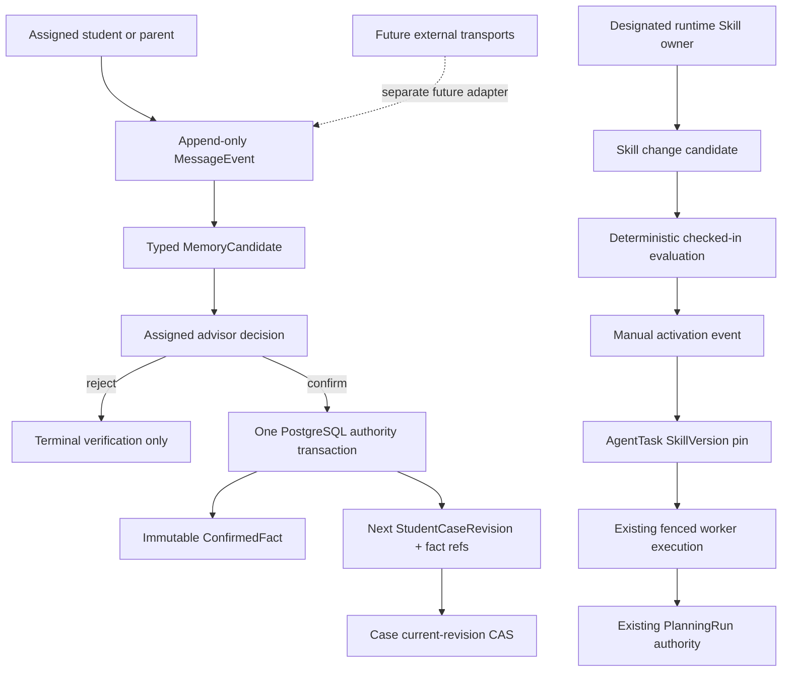

# Night Voyager Governed Collaboration Core v1 Design

## Status

Approved design. Implementation has not started.

This document defines the next bounded Night Voyager product increment after the
governed mixed-planning closure. It is a public-neutral design source intended to be
landed in the project through a separate mechanical documentation task before
implementation planning begins. Approval of this design does not by itself authorize
implementation, push, pull request creation, release, deployment, or live-provider
execution.

## Summary

Night Voyager already proves an evidence-grounded advisor-to-family decision flow,
tenant-scoped PostgreSQL authority, durable AgentTask execution, SSE recovery,
governed external Evidence promotion, and a connected local browser walkthrough.
The remaining product gap is not another provider integration. It is the governed
collaboration layer around that workflow:

1. assigned participants need one Case-scoped engagement thread;
2. a student- or parent-authored message may propose one role-allowed typed profile
   fact but may not directly alter a Case;
3. an assigned advisor must explicitly confirm or reject the proposal;
4. confirmation must atomically publish a new Case revision with complete provenance;
5. the planning capability used for every new task must be represented by an
   immutable SkillVersion, deterministic evaluation evidence, manual activation,
   audited rollback, and an execution-time pin;
6. the UI must expose this authority through a secondary collaboration walkthrough
   without changing the existing primary `/demo` journey or becoming a generic chat
   surface or global Agent control tower.

The increment is delivered as three independently reviewable pull requests:

- **PR A — governed conversation and memory authority** (migration `0007`);
- **PR B — versioned Skill governance and runtime pinning** (migration `0008`);
- **PR C — collaboration walkthrough and technical inspector**, with no migration.

The top-level PRs are sequential. PR B starts only after PR A has a retained,
authority-reviewed baseline, normally the merged PR A `main`; PR C starts only after
PR A and PR B are merged and their backend/OpenAPI contracts are frozen. Each PR may
use bounded internal parallel lanes, but migration graph ownership, shared API
wiring, integration, release verification, and full Docker/Chromium verification
remain serialized under that PR's integration owner.

## Inspected baseline

- The inspected repository baseline is
  `main@44c2c1f3fb29c52fc36fd06f307bee8263a71aec`, equal to `origin/main` and clean.
- Annotated tag and public GitHub Release `v0.1.1` point to that baseline; its formal
  public source-archive verification gate has passed.
- The migration graph is exactly `0001 -> 0002 -> 0003 -> 0004 -> 0005 -> 0006`.
- `ActorContext` supports the closed roles `advisor`, `student`, and `parent` through
  an opaque session. A separate administrator or operator role does not exist.
- `student_case_participants` already owns Case membership and must remain the
  participant authority rather than being copied into a second ACL.
- `StudentCaseRevision` persists strict student and family projections but does not
  yet preserve fact-level conversational provenance.
- AgentTask supports `generate_planning_run_v1` and
  `generate_governed_mixed_planning_run_v1`, but neither task nor execution pins a
  SkillVersion.
- PostgreSQL already owns forced RLS, runtime-role grants, narrow
  `SECURITY DEFINER` functions, idempotency, immutable ledgers, currentness, CAS,
  worker leases, and transition authority.
- The API already applies opaque session resolution, exact Origin, CSRF,
  `Idempotency-Key`, bounded problem responses, non-enumerating authorization
  failures, and `Cache-Control: no-store`.
- The Next.js BFF is transport-only and already preserves bounded bodies, deadlines,
  cookies, SSE bytes, and upstream authority.
- There is no implemented conversation, external binding, MessageEvent,
  MemoryCandidate, ConfirmedFact, Skill registry, SkillVersion, or Skill evaluation
  implementation on the inspected baseline.
- The runtime has no LangChain, LangGraph, DeepAgents, dynamic prompt registry, or
  policy-engine dependency.

## Problem

### Collaboration is not durable authority

The connected demo currently begins from already-persisted Case facts. It does not
show how a student or family member communicates a material preference, how an
advisor distinguishes ordinary discussion from a proposed fact, or how that fact
becomes a revision-pinned planning input.

A generic chat table would not solve this. Messages are communication records, not
Case authority. An automatically extracted memory is a candidate, not a confirmed
fact. Confidence, model output, provider identity, or repeated wording must never
silently grant business authority.

### Skill evolution is vocabulary without execution proof

`SkillVersion` is part of the domain vocabulary but does not exist as an executable
governance boundary. A mutable database prompt, a display-only registry, or an eval
dashboard disconnected from AgentTask execution would add complexity without
proving that a particular capability version produced a particular result.

The system needs immutable versions, deterministic evaluation evidence, explicit
human activation, auditable rollback, and a task-time pin. Activation must affect
future work only; queued or running work must retain its original contract.

### Integration pressure must not weaken product authority

External research, retrieval, OCR, or routing systems can propose inputs or deliver
messages, but they do not own Case facts, Skill activation, planning state, advisor
approval, or family decisions. The collaboration core must be useful before any
external transport becomes stable and must not depend on one.

## Goals

1. Add exactly one Case-scoped collaboration thread for assigned participants.
2. Persist bounded, append-only MessageEvents whose replay identity is the existing
   `Idempotency-Key` plus canonical request hash; do not prebuild an external delivery
   identity contract.
3. Let an assigned student or parent propose one typed profile fact from a message.
4. Let an assigned advisor confirm or reject exactly once under optimistic
   currentness and idempotency.
5. On confirmation, atomically create the terminal verification, immutable
   ConfirmedFact, supersession link, next StudentCaseRevision, complete fact-reference
   projection, Case revision CAS, audit event, and idempotency response.
6. Prevent messages, extraction confidence, external transports, and workers from
   directly changing Case facts.
7. Add immutable Skill definitions and SkillVersions for six closed capabilities.
8. Record deterministic evaluation evidence without allowing the browser to submit
   a fabricated pass result.
9. Require the designated Skill owner to activate or roll back a supported
   `planning_runtime` version; catalog-only Skills are evaluated but never activated
   or task-pinned in v1.
10. Pin the active `study-destination-compare` SkillVersion when each new planning
    AgentTask is created and preserve that pin for every execution attempt.
11. Present the collaboration and Skill authority at `/demo/collaboration` without
    displacing or changing the advisor-to-family decision narrative at `/demo`.
12. Preserve the existing RLS, human-gate, lease, fencing, SSE, Evidence, DRA, MKE,
    BFF, security, and public-claim boundaries.

## Non-goals

- No generic team chat, inbox, notification platform, CRM, or global Agent console.
- No private participant channels: the v1 collaboration thread and its messages are
  intentionally shared by all assigned Case participants.
- No autonomous memory extraction from arbitrary prose and no vector-memory store.
- No advisor transcription of a participant fact proposal in v1.
- No message or MemoryCandidate that directly mutates a Case.
- No confirmation in `advisor_review`, `family_review`, `decided`, or `plan_ready`.
- No implicit reopening of a completed decision flow.
- No binary attachment upload, file store, malware scanning, or retention service.
- No real email, WhatsApp, Slack, Teams, OpenClaw, or webhook ingress in this increment.
- No raw provider envelope, credential, cookie, token, local path, traceback, or
  private prompt persistence.
- No database-stored executable code, arbitrary prompt, user-defined schema, dynamic
  import, plugin loader, shell command, or unrestricted tool name.
- No new identity role, organization administrator, billing, production tenancy, or
  SaaS control plane.
- No LLM judge as Skill activation authority.
- No direct Skill activation by worker, evaluator, browser, CI, or external project.
- No DRA live-provider proof, MKE product-path ingestion, OCR product integration, or
  OpenClaw routing.
- No new framework dependency solely to provide memory, Skills, or orchestration.
- No deployment, SLA, real-user, admissions-result, or business-impact claim.
- No `v0.2.0` release decision in this increment.

## Product invariants

1. **PostgreSQL remains authoritative.** UI, BFF, API, workers, fixtures, external
   producers, and framework state are projections or command paths.
2. **A MessageEvent is not memory.** It is an immutable communication record.
3. **A MemoryCandidate is not a fact.** It is a strict, revision-pinned proposal.
4. **A ConfirmedFact is not produced by confidence.** Only an assigned advisor's
   explicit confirmation can create one.
5. **Confirmation is one atomic business gate.** The ConfirmedFact and next
   StudentCaseRevision either both commit or neither commits.
6. **Every memory-derived material Case input has provenance.** A revision produced
   through memory confirmation references the complete current ConfirmedFact set that
   it applied; the design does not retroactively invent fact provenance for older
   revisions.
7. **The legacy whole-revision writer is not a runtime authority path.** PR A revokes
   API execution of `publish_case_revision(...)`; the function remains only for
   migrator-controlled bootstrap and test setup. `verify_memory_candidate(...)` is
   the only runtime path that may publish the next revision from a confirmed
   collaboration fact.
8. **A SkillVersion is data about an allowed capability, not executable database
   content.** Runtime code remains checked in and reviewable.
9. **An evaluation pass is evidence, not authority.** Activation still requires the
   designated Skill owner.
10. **Activation is append-only.** Rollback appends a new activation event; it never
   rewrites version or evaluation history.
11. **Execution is pinned.** Activation and rollback affect only tasks created after
    the activation event.
12. **Existing product authority stays narrow.** No Skill or memory action can
    approve Evidence, review a PlanningRun, decide for a family, or bypass leases.
13. **Public claims follow proof.** Local deterministic behavior remains a local
    synthetic portfolio proof until separately verified otherwise.

## Architecture



## Delivery topology

### PR A — Governed conversation and memory authority

PR A introduces migration `0007_conversation_and_memory.py`, pure contracts,
PostgreSQL authority, application ports/adapters, focused HTTP endpoints, explicit
demo seed data, tests, operations documentation, and release/catalog verification.

It does not change `/demo`, planning policy, AgentTask operation, frontend package,
or any external transport.

Its accepted architecture decision is ADR `0008`; existing ADR `0007` remains the
governed mixed-evidence decision and is not renumbered or rewritten.

### PR B — Versioned Skill governance and runtime pinning

PR B introduces migration `0008_versioned_skills.py`, the Skill catalog,
deterministic evaluation, owner-controlled activation and rollback for the one
runtime-bound Skill, task-time pins, worker-side pin validation, focused HTTP
endpoints, explicit demo seed data, tests, operations documentation, and
release/catalog verification.

Registry and runtime binding ship together. The PR is not complete if SkillVersion
exists only as display metadata or if new planning AgentTasks can be created without
an active version pin.

PR B begins from the retained, authority-reviewed PR A baseline, normally merged
`main` containing migration `0007`. No mutating PR B lane starts while PR A remains
under implementation or authority review.

Its accepted architecture decision is ADR `0009`.

### PR C — Collaboration walkthrough and technical inspector

PR C adds no migration. It consumes the merged PR A and PR B contracts through the
existing transport-only BFF at the exact secondary route `/demo/collaboration` and
presents:

- a secondary Case Collaboration walkthrough;
- participant messages and structured memory proposals;
- advisor confirmation and the resulting Case revision;
- a compact confirmed-fact provenance view;
- a collapsed technical inspector showing active SkillVersion, evaluation identity,
  activation sequence, and task-time pin.

The existing connected advisor-to-family walkthrough remains the primary narrative.
The collaboration walkthrough uses an independent synthetic Case so it cannot mutate
or destabilize the existing golden flow.

## PR A detailed design

### Closed data model

Migration `0007` adds six tenant-keyed, migrator-owned tables. Every table uses
`ENABLE ROW LEVEL SECURITY`, `FORCE ROW LEVEL SECURITY`, and an explicit tenant
`USING`/`WITH CHECK` policy.

Every redundant `case_id` and parent identity is protected by an exact composite
foreign key containing `organization_id`, `case_id`, and the parent row identity.
Thread-to-message, message-to-candidate, candidate-to-verification/fact, and
fact-to-revision lineage therefore cannot cross Cases inside the same tenant.

#### `collaboration_threads`

- `organization_id`, `id`, `case_id`;
- `created_by_actor_id`, `created_at`;
- exactly one thread per Case in v1;
- an assigned advisor may create it and the explicit demo seed may pre-create it;
- immutable and always active in v1: there is no close, reopen, archive, row-version,
  or thread-status mutation.

#### `message_events`

- `organization_id`, `id`, `thread_id`, `case_id`;
- monotonic `sequence_no` scoped to the thread;
- session-resolved `actor_id` and role;
- bounded inert plain-text body, content SHA-256, idempotency request SHA-256;
- `created_at`;
- immutable and append-only in v1;
- unique `(organization_id, thread_id, sequence_no)`;
- no binary attachment, raw provider payload, token, URL credential, local path,
  traceback, or hidden prompt.

A message replay with the same actor and `Idempotency-Key` returns the original
event when the canonical request hash matches. Reuse with a different request hash
returns a typed conflict. No external source or delivery identity is reserved in
v1. The UTF-8 body is limited to `1..4096` bytes, a thread is limited to
`1000` events in v1, and read pages default to `50` with a hard maximum of `100`.
Append locks the thread row `FOR UPDATE` before deriving the next sequence number;
concurrent append tests prove a gap-free unique monotonic sequence without making
the thread itself mutable business state.

#### `memory_candidates`

- `organization_id`, `id`, `case_id`, `case_revision`, `message_event_id`;
- subject actor/role and proposing actor;
- one closed `fact_key` and one strict typed `proposed_value`;
- canonical value SHA-256 and candidate request SHA-256;
- provenance kind fixed to `participant_proposal`;
- created-at and expiry-at;
- immutable; status is derived as exactly
  `pending|stale|expired|confirmed|rejected`;
- a candidate becomes `stale` as soon as its pinned Case revision is no longer
  current; it is never rebased in place;
- each message creates at most one candidate in v1.
- unique `(organization_id, message_event_id)` enforces that cardinality.

Derived status precedence is terminal `confirmed|rejected`, then `stale` when the
pinned revision is no longer current, then `expired` by database clock, otherwise
`pending`. Terminal decisions are unique and cannot be overwritten by later
staleness or expiry.

The closed fact keys are:

| Fact key | Allowed source role | Strict value |
| --- | --- | --- |
| `student.intended_field` | student | bounded non-empty string |
| `student.preferred_countries` | student | sorted unique subset of the supported country vocabulary |
| `student.intake` | student | exact `YYYY-MM` string |
| `family.risk_tolerance` | parent | closed risk vocabulary |
| `family.japan_risk_accepted` | parent | boolean |
| `family.budget` | parent | existing strict CNY budget projection |

New string proposals are limited to `160` UTF-8 bytes. Intake must match exact
calendar syntax and a valid month. These proposal bounds do not silently coerce
historical Case data.
Verification reasons are limited to `512` UTF-8 bytes. A pending candidate expires
after seven days according to the database clock and cannot be revived in place.

Only the student or parent who authored the source message may create its candidate.
Advisor-authored discussion cannot manufacture or transcribe a student or family
profile fact in v1.

#### `memory_candidate_verifications`

- `organization_id`, `id`, `candidate_id`, `case_id`;
- assigned advisor actor;
- terminal decision `confirm|reject`;
- bounded public-safe reason;
- request SHA-256 and optional resulting fact/revision identity;
- immutable and unique per candidate.
- `confirm` requires both resulting ConfirmedFact and Case revision identities;
  `reject` requires both to be absent.

#### `confirmed_facts`

- `organization_id`, `id`, `case_id`, `fact_key`;
- strict typed value and canonical SHA-256;
- source candidate, source message, subject actor, confirming advisor;
- `supersedes_fact_id` and monotonic fact version;
- immutable; currentness is derived from the supersession chain;
- no unverified, expired, or rejected candidate can create a row.
- unique `(organization_id, case_id, fact_key, fact_version)` and at most one
  successor for each `supersedes_fact_id`.

Case-row serialization plus exact `supersedes_fact_id`, monotonic version, and
function-level head validation prevent a forked current chain for the same
`(organization_id, case_id, fact_key)`. Runtime direct DML remains denied.

#### `case_revision_confirmed_fact_refs`

- `organization_id`, `case_id`, `case_revision`, `confirmed_fact_id`, `fact_key`;
- immutable many-to-many projection of every current confirmed fact applied to the
  resulting StudentCaseRevision;
- exact composite foreign keys include tenant, Case, fact key, and fact identity so a
  revision cannot claim unrelated facts merely because application code checked it.

### Conversation and memory transitions

```text
assigned participant
  -> append MessageEvent
  -> propose one role-allowed MemoryCandidate
  -> pending

assigned advisor + current candidate
  -> reject
  -> terminal verification + audit + idempotency response
  -> no ConfirmedFact and no Case revision

assigned advisor + current candidate
  -> confirm
  -> acquire idempotency advisory lock
  -> lock Case, candidate, prior current fact, and current PlanningRun in that order
  -> validate Case state, current revision, subject role, fact key, value, expiry
  -> reject if an active AgentTask exists
  -> terminal verification
  -> immutable ConfirmedFact and supersession link
  -> clone current revision projection and replace exactly one supported field
  -> next StudentCaseRevision
  -> complete confirmed-fact reference projection
  -> current Case revision CAS
  -> mark any prior current PlanningRun non-current
  -> audit + idempotency response
  [all writes commit or roll back together]
```

Confirmation is allowed only while the Case is `intake` or `planning`. An AgentTask
in `queued`, `leased`, `running`, or `waiting_review` makes the command stale. The
Case state does not advance. A new or superseding planning task must be explicitly
created against the new revision.

The lock and write order is fixed: idempotency advisory lock, Case `FOR UPDATE`,
candidate, prior current fact, current PlanningRun, terminal verification,
ConfirmedFact, cloned revision, complete fact-reference projection, Case CAS,
PlanningRun currentness change, audit event, then idempotency response. Tests must
inject a failure after every consequential boundary and prove complete rollback.

### Runtime functions and grants

The exact implementation names may be normalized during planning, but the authority
surface is limited to these operations:

- `create_collaboration_thread(...)`;
- `append_collaboration_message(...)`;
- `propose_memory_candidate(...)`;
- `verify_memory_candidate(...)`;
- `seed_demo_collaboration(...)`, migrator only.

API receives only the four mutation-function grants and narrow read-projection
functions. It receives no direct table `SELECT`. Those projections enforce current
tenant, actor, role, Case assignment, role-safe field visibility, and
non-enumeration inside PostgreSQL. Worker receives no conversation or memory table
or function access. `PUBLIC` receives none. Runtime roles receive no direct
`INSERT`, `UPDATE`, `DELETE`, or `TRUNCATE`. Every function fixes `search_path`,
validates the current tenant/actor/role context, and performs participant checks in
PostgreSQL.

PR A also revokes `night_voyager_api` execution of the legacy
`publish_case_revision(uuid,uuid,integer,integer,jsonb,jsonb)` function. The migrator
retains the bounded bootstrap/test-setup path; runtime revision publication goes
only through `verify_memory_candidate(...)`.

The application layer removes or isolates the corresponding runtime
`CaseService.publish_revision()` / `PlanningRepository.create_revision()` seam so an
API caller cannot bypass the new authority merely because the SQL grant disappeared.
Release verification and catalog/grant tests lock this boundary. Bootstrap and test
setup use the migrator-owned path explicitly.

Existing `audit_events` and `idempotency_records` are reused. No second generic audit
or idempotency ledger is introduced.

### HTTP surface

All mutation endpoints require opaque session, exact Origin, session-bound CSRF,
`Idempotency-Key`, strict `extra="forbid"` DTOs, bounded bodies, and `no-store`.
Authorization failures remain non-enumerating.

| Endpoint | Allowed actor |
| --- | --- |
| `POST /api/v1/cases/{case_id}/collaboration-thread` | assigned advisor |
| `GET /api/v1/cases/{case_id}/collaboration-thread` | assigned participants |
| `GET /api/v1/collaboration-threads/{thread_id}/messages` | assigned participants |
| `POST /api/v1/collaboration-threads/{thread_id}/messages` | assigned participants |
| `POST /api/v1/messages/{message_id}/memory-candidates` | source participant only |
| `GET /api/v1/cases/{case_id}/memory-candidates` | assigned advisor, or source participant through own-proposal projection |
| `POST /api/v1/memory-candidates/{candidate_id}/verification-decisions` | assigned advisor |
| `GET /api/v1/cases/{case_id}/confirmed-facts` | assigned participants through role-safe projection |

Pagination uses a stable sequence cursor. There is no websocket, message SSE, typing
indicator, unread counter, free-text search, or external webhook.

### ConfirmedFact visibility matrix

The API never returns one generic fact projection to every participant.

| Projection | Advisor | Student | Parent |
| --- | --- | --- | --- |
| Current `student.*` values | yes | yes | yes |
| Current `family.*` values | yes | yes | yes |
| Current own proposal status | yes | own proposals only | own proposals only |
| Historical/superseded values | yes | no | no |
| Fact version and confirmed-at | yes | yes | yes |
| Subject role | yes | yes | yes |
| Source message sequence and digest prefix | yes | no | no |
| Candidate/verification IDs | yes | no | no |
| Confirming advisor identity | yes | role label only | role label only |
| Verification reason | yes | no | no |
| Supersession chain | yes | no | no |

All assigned participants may read the shared thread itself, but the confirmed-fact
read model does not use thread visibility to broaden fact-history or verification
metadata. PostgreSQL, HTTP, and Chromium tests must prove this matrix and wrong-role
absence, not merely frontend hiding.

### Typed value and data-safety policy

Candidate safety is structural, not a broad lexical prompt-injection filter. Strict
typed schemas, exact fact and role allowlists, `extra="forbid"`, canonical bounds,
country/currency/date vocabularies, and value-specific validation own acceptance.
Strings additionally reject control characters, secret or credential material,
local paths, URLs, and executable or shell-like content. A normal preference that
happens to contain words such as “approve” or “ignore” is not rejected merely by
keyword.

The message itself is bounded inert plain text after control-character and
secret-pattern checks. It is never interpreted as a prompt or command, and storing
it never grants its contents authority.

## PR B detailed design

### Closed Skill catalog

The catalog has exactly six Skill keys:

1. `student-profile-intake`;
2. `study-destination-compare`;
3. `evidence-research`;
4. `document-evidence-retrieval`;
5. `family-decision-brief`;
6. `application-timeline-guard`.

PR B adds five tenant-keyed, forced-RLS tables and immutable pin columns on the
existing AgentTask/AgentExecution authority records.

#### `skill_definitions`

- organization, stable ID, closed Skill key, designated owner advisor,
  `binding_kind` in `catalog_only|planning_runtime`, created-at;
- unique per organization and Skill key;
- owner is an existing organization advisor membership, not a new identity role or
  a Case-participant requirement;
- changing ownership is outside v1 and requires a later explicit authority design.

#### `skill_versions`

- immutable strict `MAJOR.MINOR.PATCH` version;
- checked-in top-level executor ID/version and runtime-binding digest only when the
  parent definition is `planning_runtime`; these fields must be absent for
  `catalog_only`;
- input/output contract IDs and schema SHA-256 values;
- canonical content SHA-256;
- sorted unique closed tool IDs and data scopes;
- side-effect level and approval policy from closed vocabularies;
- policy version, evaluation dataset identity/version/SHA-256;
- runtime manifest ID/version/SHA-256;
- optional superseded version;
- no mutable active/status field;
- no executable code, arbitrary prompt, user-defined schema, import path, package URL,
  shell command, or unrestricted tool identifier.

#### `skill_change_candidates`

- base version and proposed immutable version; for `planning_runtime`, the base must
  equal the current active version; for `catalog_only`, it must equal the latest
  registered catalog version;
- provenance in `badcase|advisor_feedback|eval_failure|maintainer_proposal`;
- bounded public-safe reason/reference and request hash;
- lifecycle derived from evaluation and, only for `planning_runtime`, activation
  ledgers. A catalog-only candidate can become evaluated but never active.

#### `skill_evaluation_results`

- candidate/version identity;
- checked-in evaluator ID/version;
- exact dataset ID/version/SHA-256;
- canonical assertion projection and output SHA-256;
- `passed|failed` plus bounded failed assertion IDs;
- immutable and server-produced;
- the browser cannot submit pass/fail or arbitrary assertion output.

#### `skill_activation_events`

- append-only `seed|promote|rollback` event;
- activated and previous version;
- candidate and evaluation references where applicable;
- owner actor, bounded reason, request hash, monotonic sequence, created-at;
- current active version is projected from the latest event;
- exactly one current activation per organization and `planning_runtime` Skill
  definition; `catalog_only` definitions have none;
- rollback appends an event targeting a previously activated, still-supported version.

#### AgentTask and AgentExecution pin columns

`agent_tasks` receives the minimal server-resolved pin:

- `skill_definition_id`;
- `skill_version_id`;
- `skill_activation_event_id`;
- `skill_activation_sequence`;
- `runtime_binding_sha256`.

These fields are immutable after insert and participate directly in the
effective-task partial unique index, so a newly activated version may create a new
task for otherwise identical inputs. Version content, contracts, evaluator, and
dataset identities remain normalized on the immutable referenced SkillVersion and
evaluation rows rather than being copied into redundant task columns.

`agent_executions` receives an immutable copy of the same five-field pin at claim
time and retains the actual selected leaf `adapter_id` and `adapter_version`.
Database guards require an exact match with the parent task and prevent later
task-state or execution-state mutations from changing provenance. No separate
display-only pin table is used.

### Checked-in runtime manifest

`fixtures/skills/runtime-manifest-v1.json` is the server-owned bridge between a
database SkillVersion row and executable checked-in code. A strict Python
`SkillRuntimeRegistry` loads and validates this packaged checked-in manifest. The
database does not read a repository file or invent executable bindings; it stores
immutable registered identities and enforces foreign keys, CAS, and exact hash
equality supplied by the trusted application path. Each supported tuple contains
the exact:

- Skill key, semantic version, and `binding_kind`;
- input/output contract IDs and schema SHA-256 values;
- content, tool-allowlist, data-scope, policy, and evaluation-dataset digests;
- side-effect level and approval policy.

For `planning_runtime`, the tuple also contains the exact top-level executor and
closed operation-to-leaf map. For `catalog_only`, executable binding fields must be
absent; a catalog entry cannot masquerade as a dormant runtime plugin.

The single runtime-bound Skill uses top-level executor
`planning_adapter_router@v1`. Its closed operation map is:

```text
generate_planning_run_v1
  -> deterministic_planning@m4a-v1

generate_governed_mixed_planning_run_v1
  -> governed_mixed_planning@dra-mixed-v1
```

The canonical complete map is included in `runtime_binding_sha256`; selecting only
one leaf or changing either operation binding changes that digest.

Candidate creation and evaluation load the checked-in entry and require a
byte-for-byte canonical match. Activation, task creation, and worker start further
require `binding_kind=planning_runtime` and the executable operation map. A database
caller cannot self-declare a supported executor or contract. Adding a new runtime
version therefore requires a normal reviewed code change containing its manifest
entry and executable compatibility before any organization can activate it.

HTTP candidate creation accepts only the Skill key, `proposed_version`, provenance,
and bounded reason/reference. It never accepts executor, schema, digest, tool scope,
runtime binding, or evaluation output. The server resolves the complete registered
tuple, requires the immutable SkillVersion to be pre-registered, and creates the
candidate atomically. An unknown or not-yet-registered version fails closed; the
candidate path never inserts a SkillVersion. A candidate/version/evaluator/dataset
tuple has exactly one deterministic
evaluation result; identical replay returns it and a conflicting pass/fail result is
impossible. Loading `1.0.1` from the checked-in registry into PostgreSQL is an
explicit implementation and test step, not an implicit browser or seed side effect.

### Seed and supported runtime binding

Explicit idempotent demo seed creates all six definitions, immutable `1.0.0`
versions, and deterministic evaluation evidence. Migration `0008` remains
seed-free. Only `study-destination-compare`, whose binding kind is
`planning_runtime`, receives a seed activation event. The other five are
`catalog_only`: they may have immutable versions and evaluations, but cannot be
activated, rolled back, or task-pinned in v1.

Only `study-destination-compare` is runtime-bound in v1. Both planning operations
resolve its current active version inside the existing task-creation transaction and
insert the immutable pin before dispatch. The worker materializes and validates that
pin before starting an execution.

The five-field server-resolved pin is part of the effective task identity alongside
organization, Case, operation, Case revision, source pack, source-pack version, and
planning policy. Activating a supported new SkillVersion therefore permits a new
task for otherwise identical inputs. Task pin insertion, effective-task uniqueness,
idempotency replay, and dispatch insertion occur in one transaction. Replaying the
original request returns the original task and original pin; it never silently
resolves the newly active version.

Task creation and activation use one lock protocol. Idempotency replay is resolved
first. A new task then locks the `study-destination-compare` definition `FOR SHARE`,
reads the latest activation, validates the manifest tuple, and inserts the complete
pin, effective-task identity, and dispatch row in one transaction. Activation and
rollback lock the same definition `FOR UPDATE`. Both the manual existing-task check
and the effective-task partial unique index include the complete five-field pin, so
task creation cannot race an activation into an indeterminate old/new binding.

The other five definitions are governed catalog contracts and must be labeled
`catalog_only` in API/UI projections until separately wired. The implementation must
not claim that they execute merely because they have versions or passing evaluations.

Any active execution task that predates `0008` and lacks a pin is cancelled during
upgrade with a bounded migration code before the new worker path becomes active. For
this rule, only `queued|leased|running` are cancelled; `waiting_review` and terminal
historical tasks remain intact and are explicitly projected as `legacy_unpinned`.
New task creation fails closed if seed/activation is absent.

The v1 proof includes checked-in supported versions
`study-destination-compare@1.0.0` and `study-destination-compare@1.0.1`.
`1.0.1` is a compatibility and evaluation revision that adds deterministic negative
coverage while preserving the same executor, operation map, tools, data scope,
side-effect level, approval policy, and product behavior. It does not pretend to add
a duplicate-country guard that the current task policy already enforces. Candidate,
exact evaluation, manual activation, new-task identity, preserved old-task pin, and
rollback are all exercised. Other Skill keys seed only their initial `1.0.0`
catalog version.

### Persisted Case revision materialization

PR B closes the existing synthetic-adapter seam that copies the checked-in fixture
Case instead of reading the requested persisted revision. A bounded worker-only
snapshot materializer loads the exact organization, Case, and revision from
`student_case_revisions`, then combines those student/family facts with the existing
fixed synthetic source pack, Evidence, cost, FX, and ranking baseline. It performs no
new provider call and grants no API mutation authority.

Both planning operations therefore consume the exact persisted Case revision. The
governed mixed operation retains its existing PostgreSQL snapshot path; the
synthetic operation gains the equivalent revision-bound path. The closed supported
country vocabulary remains Australia, Japan, and Malaysia, while
`preferred_countries` may be any non-empty sorted unique subset. Payload validation
and pure policy return only the selected routes. Result persistence filters route,
cost, ranking, and route-to-Evidence projections to that selected scope; baseline
Evidence may remain an input record but cannot appear as an unselected-country
product result. When Australia is not selected, no Australia route/cost/ranking or
eligible AdvisorReview projection may be created. The canonical seed containing all
three countries preserves the existing golden outcome. Intake, Japan risk
acceptance, and budget continue to affect their existing deterministic rules. Other
strict Case facts remain revision-pinned inputs even when a current policy result is
unchanged.

The materializer rejects missing, stale, cross-tenant, malformed,
unsupported-country, or pin-mismatched revisions before adapter execution. Tests
prove that a confirmed budget, intake, Japan-risk, or preferred-country change is
present in the next task's actual PlanningInput and that the old fixture Case cannot
overwrite it.

Counterfactual coverage includes one-country and two-country selections plus empty,
duplicate, unsorted, and unsupported-country rejection.

### Deterministic evaluation

The checked-in `fixtures/skills/eval-manifest-v1.json` defines stable cases and
negative assertions. The evaluator invokes existing pure policies and projections;
it does not call a model, provider, external transport, shell pytest command, or LLM
judge as authority.

Minimum assertions:

- `student-profile-intake`: unconfirmed profile data remains unconfirmed; typed
  unsafe-value and cross-role fact proposals fail closed;
- `study-destination-compare`: Australia remains conditional, Malaysia blocked,
  budget refusal and baseline/hash drift fail closed;
- `evidence-research`: terminal-invalid and fallback DRA output remains an untrusted
  candidate until human Evidence promotion;
- `document-evidence-retrieval`: zero-hit/no-match MKE output cannot become sufficient
  Evidence;
- `family-decision-brief`: an unreviewed PlanningRun cannot produce a Brief and a
  blocked route cannot become eligible;
- `application-timeline-guard`: no FamilyDecision means no timeline and milestone
  dates remain deterministic.

### Activation and rollback

Activation locks the Skill definition and atomically proves:

- caller is the designated owner advisor;
- the Skill is `planning_runtime`, not `catalog_only`;
- candidate base equals the current active version;
- exact registered evaluator and dataset produced a passing result;
- content, contract, policy, and dataset hashes agree across records;
- semantic version increases monotonically;
- executor/tool/data scope/side-effect/approval contract remains within the closed
  code-supported allowlist;
- stale or concurrent first activation cannot create two active versions.

Rollback uses expected active sequence/version CAS. The target must be a version that
was previously activated for the same Skill and remains supported by checked-in
runtime code. Rollback never deletes the failed version, evaluation, or activation
history.

### Runtime functions and grants

The bounded operations are:

- `create_skill_change_candidate(...)`;
- `record_skill_candidate_evaluation(...)`;
- `promote_skill_change_candidate(...)`;
- `rollback_skill_activation(...)`;
- `seed_demo_skill_registry(...)`, migrator only.

API receives the four runtime function grants and narrow advisor/owner read
projections, not direct registry table `SELECT`. Worker receives only the narrow
projection needed to validate an existing task pin and no catalog,
promotion/rollback, or direct-table authority. Runtime roles receive no direct DML
or TRUNCATE. `PUBLIC` receives nothing.

The existing task-creation and worker functions are extended narrowly so that task
pin insertion, claim materialization, and execution validation remain fenced in the
same PostgreSQL authority path.

SQL claim performs relational pin validation and copies the five fields into the new
leased execution. Python then validates the copied pin against the same
`SkillRuntimeRegistry`, exact operation binding, and complete
`runtime_binding_sha256` after claim/load but before `start_agent_task`. The
canonical worker input hash is the canonical object `{request, five_field_pin}`.
Missing, legacy, stale, mismatched, unsupported, or catalog-only pins fail closed
before adapter execution.

If Python detects an invalid pin while the generation-fenced execution is still
`leased`, it calls the existing non-retryable fenced failure path with bounded public
code `skill_pin_invalid`, records the execution audit facts, removes dispatch
eligibility, and does not call an adapter. It must not enter `start_agent_task`, call
an adapter, or leave the invalid task in a reclaim loop.

### HTTP surface

| Endpoint | Allowed actor |
| --- | --- |
| `GET /api/v1/skills` | organization advisor |
| `GET /api/v1/skills/{skill_key}` | organization advisor |
| `POST /api/v1/skills/{skill_key}/change-candidates` | designated owner advisor |
| `POST /api/v1/skill-change-candidates/{candidate_id}/evaluations` | designated owner advisor; result computed server-side |
| `POST /api/v1/skill-change-candidates/{candidate_id}/activations` | designated owner advisor |
| `POST /api/v1/skills/{skill_key}/rollbacks` | designated owner advisor |
| `GET /api/v1/cases/{case_id}/planning-skill-inspector` | assigned advisor |

Responses expose public-safe contract IDs and digests, never internal prompt text,
raw evaluator payload, local path, stack trace, or private test location.

The planning Skill inspector is one server-owned composite read model. It returns
the operation, active version/evaluation/activation identity, task pin, actual leaf
adapter identity, bounded digest prefixes, and
`pin_status=not_created|matched|legacy_unpinned`. The browser must not join registry,
task, execution, and activation records into an authority claim.

## PR C detailed design

### Collaboration walkthrough

The frontend adds the exact secondary route `/demo/collaboration`, backed by a
separate seeded synthetic Case and a pre-created shared thread. It must show:

1. parent session mint and one parent-authored bounded message;
2. one structured `family.budget` proposal from that exact message;
3. the pending MemoryCandidate with source-message provenance;
4. real parent-session revoke followed by advisor bootstrap and mint;
5. advisor confirmation through the atomic authority function;
6. authoritative reload of the resulting ConfirmedFact and incremented Case
   revision;
7. an explicit `Re-plan required` state rather than automatic task creation or
   silent reuse of stale output.

The original advisor-to-family connected journey remains unchanged and remains the
default `/demo` path. The secondary journey has no role selector and is not a
general chat client.

### Technical inspector

The same collapsed native disclosure consumes the server-owned inspector projection
in two places:

- the existing `/demo` advisor phase shows an actual task changing from
  `not_created` to `matched` without changing that journey's Case, mutation flow, or
  primary narrative;
- `/demo/collaboration` shows `not_created` after confirmation, making the explicit
  `Re-plan required` boundary visible without creating a task.

The disclosure shows:

- planning operation;
- active Skill key and version;
- activation sequence;
- evaluator and dataset identity;
- bounded task/version/binding digest prefixes;
- actual leaf adapter and
  `pin_status=not_created|matched|legacy_unpinned`.

It must not expose random UUIDs as primary copy, raw JSON, internal paths, secrets,
database role names, or a global task/control dashboard. PR C does not add a Skill
management UI.

### BFF and browser boundaries

- BFF handlers remain explicit and transport-only; no catch-all proxy.
- Existing explicit identity/session handlers are reused. The new BFF surface is
  frozen to these eight method handlers; the pre-seeded thread has no browser create
  handler:

| Method and BFF path | Upstream purpose |
| --- | --- |
| `GET /api/demo/cases/{case_id}/collaboration-thread` | shared thread read |
| `GET /api/demo/collaboration-threads/{thread_id}/messages` | paged message read |
| `POST /api/demo/collaboration-threads/{thread_id}/messages` | append message |
| `POST /api/demo/messages/{message_id}/memory-candidates` | propose typed fact |
| `GET /api/demo/cases/{case_id}/memory-candidates` | advisor or own-proposal role-safe read |
| `POST /api/demo/memory-candidates/{candidate_id}/verification-decisions` | advisor decision |
| `GET /api/demo/cases/{case_id}/confirmed-facts` | role-safe current facts |
| `GET /api/demo/cases/{case_id}/planning-skill-inspector` | advisor-only composite inspector |

- Mutations enforce browser Origin and use server-configured upstream Origin.
- Same-tab metadata becomes an exact `schema_version=2` envelope with
  `journey=advisor-family|collaboration` and discriminator-specific `extra="forbid"`
  shapes. Collaboration metadata may retain only server-projected Case/thread/message/
  candidate IDs, cursor-free phase state, and request-bound mutation records; every
  reload revalidates those IDs through server projections rather than treating them
  as authority.
- A residual cookie from the other journey cannot be silently reused. The browser
  offers only “Return to current walkthrough” or “End current walkthrough and start
  collaboration”; the latter performs real CSRF-protected revoke before clearing
  metadata and bootstrapping the next role. The choice is symmetric when returning
  to the advisor-family journey.
- Only a successful revoke, or an explicit retry after the server returns a bounded
  401 and clears the cookie, permits the next bootstrap. Ambiguous revoke or lost
  acknowledgement preserves metadata and never permits a client-only role flip.
- Session/bootstrap recovery remains closed and no-store.
- Multiple Set-Cookie values remain independently appended.
- No UI field can submit evaluation pass/fail, activation sequence, actor identity,
  Case revision, or authority-derived digest.
- Before each message append, candidate proposal, or verification decision, the
  client persists a canonical request fingerprint and idempotency key in the strict
  journey envelope. An unknown outcome may retry only the identical body/key. A 401
  clears the mutation retry record and forbids automatic replay; a 409 first reloads
  authoritative state. Confirmation lost acknowledgement cannot enter
  `replan_required` until the subsequent read proves the new fact and revision.
- Collaboration uses an independent reducer with the closed states
  `bootstrapping_parent -> thread_ready -> message_submitting -> proposal_pending ->
  switching_to_advisor -> advisor_reviewing -> confirmation_submitting ->
  replan_required`, plus `recoverable_error`. It does not enlarge the existing M5
  connected-demo reducer.
- `replan_required` is entered only after an authoritative reload proves the new
  ConfirmedFact and Case revision; the confirmation response alone is insufficient.
- `/demo/collaboration` creates no AgentTask, opens no EventSource, and does not poll
  planning state. The inspector is an ordinary `no-store` GET. The existing `/demo`
  retains at most one EventSource and a monotonic cursor; its native terminal and
  reconnect behavior is not rewritten by the collaboration route.
- 1440, 768, and 390 px layouts preserve readable provenance and touch targets.
- Keyboard focus, landmarks, wrong-role hiding, stale conflict, reload, and teardown
  are covered by real Chromium proof.

## Error and recovery contract

New public problem codes remain closed, bounded, and mapped from typed domain or SQL
errors. The final names are frozen during implementation planning, but the required
categories are:

- collaboration or Skill resource not found/non-enumerating;
- actor not assigned or wrong authority;
- stale Case revision, candidate, or activation sequence;
- invalid message, unsupported fact, unsafe value, or expired candidate;
- active task prevents Case revision publication;
- candidate already terminal or idempotency conflict;
- Skill unavailable, unsupported contract, evaluation failed, scope expansion,
  unsupported rollback target, or task pin invalid;
- session recovery required, upstream unavailable, or bounded deadline exceeded;
- persistence unavailable and bounded internal failure.

No error exposes raw SQL, traceback, provider payload, prompt, path, credential,
cookie, token, or unbounded upstream body.

The collaboration reducer maps the closed public problem allowlist into exactly:

- `stale`;
- `expired_or_terminal`;
- `active_task_blocked`;
- `unsafe_or_unsupported`;
- `wrong_role_or_not_found`;
- `session_recovery_required`;
- `transport_unavailable_or_timeout`.

Unknown codes fail closed as a bounded unavailable state. The client does not map
all HTTP 409 responses to stale: idempotency conflict, terminal candidate, active
task, and stale revision remain distinguishable through their approved public codes.

## Migration and downgrade rules

### `0007 -> 0006`

- fail closed when any collaboration or memory authority data exists, including a
  thread, message, candidate, rejection or confirmation, ConfirmedFact,
  revision-fact reference, or PR A audit/idempotency record selected by the exact
  collaboration operation/event discriminator; unrelated M3B/M4A history does not
  block an otherwise empty-boundary downgrade;
- only on a truly empty collaboration boundary may downgrade delete the six tables
  and narrow functions while preserving M1–M5, DRA promotion, and governed
  mixed-planning structures;
- the exact `0006` function signature, API grant, application verifier contract, and
  test setup behavior are restored during downgrade so the round trip is explicit
  rather than half-revoked;
- test the empty-data round trip and the with-data refusal as separate paths.

### `0008 -> 0007`

- allow deletion only when Skill rows are the exact reproducible canonical seed and
  no task or execution pin exists;
- fail closed when any non-canonical-seed change candidate or evaluation,
  promote/rollback activation event, or task/execution pin exists, including terminal
  history; exact canonical seed evaluations and seed activation are reproducible and
  may be deleted, while removing any non-seed history would destroy governance or
  execution provenance;
- on a canonical-seed-only/no-pin database, remove Skill tables, pin columns,
  functions, grants, and task creation/worker extensions and restore `0007` behavior;
- restore the exact `0007` task/worker functions, effective-task index, grants, and
  verifier contract; no mixed old/new signature may remain;
- test empty/canonical-seed round trip, non-seed governance-history refusal,
  active-pin refusal, and terminal-pin refusal as separate paths;
- never delete or reinterpret pinned execution history to make downgrade succeed.

Both migrations require focused empty-data downgrade/re-upgrade and full graph
round-trip proof plus explicit with-authority-data refusal proof.

Demo bootstrap order is fixed: registry/version/evaluation seed, runtime activation,
then any task-ready Case seed. A task-ready seed cannot run before the runtime pin is
available.

## Security and authority verification

Each backend PR must prove:

- exact table/function/policy catalog;
- migrator ownership and no runtime ownership;
- forced RLS with dual-tenant same/cross-tenant reads and writes;
- same-tenant cross-Case lineage rejection through the exact composite foreign keys;
- missing/invalid tenant, actor, role, Case, thread, and candidate contexts;
- API/worker/PUBLIC grant separation;
- API denial on legacy `publish_case_revision(...)`, with bootstrap fixtures moved to
  the migrator-owned setup path;
- direct `INSERT`, `UPDATE`, `DELETE`, and `TRUNCATE` denial;
- fixed function `search_path` and revoked PUBLIC execute;
- immutable message/candidate/fact/version/eval/activation/pin histories;
- idempotent replay and different-request conflict;
- concurrent terminal memory decision and concurrent first Skill activation with one
  winner;
- stale Case revision, stale activation, wrong owner, wrong role, and cross-tenant
  non-enumeration;
- injected failure at every consequential write boundary with full rollback;
- size-one pool context cleanup;
- repeated seed, downgrade/re-upgrade, and full migration graph;
- no secret, private path, raw provider envelope, arbitrary prompt, or executable
  content in persistence or public output.

## Test strategy

### Pure and contract tests

- strict Pydantic models, extra-field rejection, canonical hashes, bounds;
- role-to-fact allowlist and typed unsafe-value refusal;
- memory transitions, supersession, Case projection replacement;
- strict semantic versioning, closed executors/tools/scopes, no authority expansion;
- deterministic Skill eval manifest and stable assertion IDs;
- task pin compatibility and legacy projection;
- architecture contracts for migration numbers, router registration, Make/CI routing,
  public documentation, and dependency stability.

### PostgreSQL and HTTP tests

- all runtime and concurrency evidence described above;
- real session, Origin, CSRF, idempotency, strict DTO, no-store, and RFC 9457 paths;
- revision publication and task-pin creation through the actual functions;
- worker rejection of missing, stale, or mismatched Skill pins;
- revision-bound synthetic and governed-mixed materialization using the exact
  persisted Case facts rather than the fixture Case;
- existing synthetic and governed mixed planning operations remain green.

### Compose and browser proof

PR A and PR B run existing Compose proof plus focused backend proof. PR C adds the
real collaboration walkthrough and technical inspector to Chromium verification.
Full Docker, database, Compose, and Playwright gates are serialized; parallel agents
must not run destructive or resource-heavy global gates concurrently.

The existing terminal browser lane remains dedicated to the native SSE
terminal/reconnect proof. The normal lane runs the unchanged default connected golden
flow plus the new collaboration flow against an independent seeded Case. The new
real-browser evidence covers parent message/proposal, real revoke and advisor mint,
wrong-role 404, confirmation lost-ack replay, authoritative fact/revision reload,
active-task/stale/expired failures, inspector `matched` and `not_created`, reload,
keyboard and landmark behavior, mutation focus moved to the new phase heading,
44-pixel minimum targets, no horizontal overflow at 1440/768/390, and teardown. It
must not expose raw UUIDs, JSON, internal database roles, private paths, or debug copy.

Minimum final commands remain:

```bash
make doctor MODE=dev
uv lock --check
make check
make proof
make compose-proof
make down
docker compose ps --all
git diff --check
```

Focused `collaboration-check` and `skills-check` targets may be added, but hosted
required check names remain the successful repository contexts
`python`, `frontend`, and `compose` unless a live hosted run proves a deliberate
governance change.

## Framework reuse decision

The design intentionally reuses the existing Pydantic, FastAPI, PostgreSQL,
SQLAlchemy, Alembic, worker, and BFF boundaries. LangChain, LangGraph, DeepAgents,
Mem0, a plugin registry, a generic policy engine, and a dynamic prompt platform were
considered unnecessary for this contract:

- conversation and memory authority is relational, transactional, tenant-scoped,
  and human-gated;
- SkillVersion represents closed application capability metadata and execution pins,
  not a framework graph or arbitrary prompt;
- current deterministic evaluators already exist as pure project code;
- adding a framework would not own Case, activation, or execution authority and would
  enlarge dependency and migration risk.

Future framework or external adapter integration must consume these contracts rather
than replace their authority.

## Documentation impact

Each implementation PR updates, where applicable:

- bilingual README milestone and local-proof boundary;
- `DESIGN.md` domain and authority projection;
- domain, HTTP, AgentTask/SSE, database-role, and operations references;
- accepted ADR `0008` for collaboration/memory and accepted ADR `0009` for
  versioned Skills;
- implementation spec/plan completion state;
- demo storyboard, route/state matrix, and browser screenshots in PR C.
- PR C also corrects ADR `0006` so its status accurately records that the connected
  demo/BFF authority was implemented before this increment; it must no longer say
  that M5 implementation has not started.
- PR C updates `docs/design/route-map.md`, whose current single-connected-route
  statement becomes stale, plus the state matrix, storyboard, connected-demo
  runbook, and a new real collaboration screenshot. Existing M5 screenshots are not
  relabeled as collaboration evidence.

Public documentation must distinguish:

- implemented runtime behavior from catalog-only Skill contracts;
- session-based local collaboration from future external routing;
- ConfirmedFact authority from arbitrary message content;
- local synthetic proof from production deployment or real-user evidence.

## Parallel execution boundary

The three top-level PRs remain sequential. Each PR uses one integration owner that
may delegate at most three independent bounded lanes with explicit file ownership
and local acceptance boundaries. The parent exclusively owns:

- migration graph and all migration files;
- shared router registration and `api.py`;
- seed ordering and shared database scripts;
- Makefile, CI, Compose, release verifier, docs index, and shared operations docs;
- integration commits, full Docker/database/Chromium gates, and final diff review.

Candidate parallel units include:

- PR A pure conversation/memory models, policy, and unit tests;
- PR A application/HTTP contracts after model interfaces freeze;
- PR B pure Skill models/catalog/evaluator and unit tests;
- PR B public DTO/read projections after the catalog interface freezes;
- PR C frontend components and tests after both backend OpenAPI contracts freeze.

PR B starts only from retained reviewed PR A authority, normally merged `main`. PR C
starts only after PR A and PR B are merged and their backend/OpenAPI contracts are
frozen. There are no parallel mutating top-level PRs.

Two agents must never simultaneously edit the migration graph, shared release
verifier, database runner, Makefile, API composition root, or the same public docs.
Child lanes use isolated worktrees or equivalent isolation and report an exact
inventory; the parent integrates and accounts for every clean/dirty state and unique
commit. Docker, PostgreSQL, Compose, and Playwright use one global serialized slot.

## Acceptance criteria

The increment is complete only when all three PRs are merged and post-merge hosted
checks succeed, with the following evidence:

1. participant message -> typed candidate -> advisor confirmation -> new Case
   revision is proven through actual PostgreSQL and HTTP authority paths;
2. reject, stale, expired, concurrent, wrong-role, cross-tenant, structurally unsafe
   value, active-task, and rollback paths fail closed without partial writes;
3. six immutable Skill definitions and versions are seeded and evaluated, with one
   `planning_runtime` Skill and five accurately labeled `catalog_only` Skills;
4. activation and rollback for the runtime-bound Skill are owner-controlled,
   append-only, idempotent, concurrent, and auditable; catalog-only activation fails
   closed;
5. every newly created planning AgentTask has the exact active
   `study-destination-compare` pin, the pin participates in effective-task identity,
   and every execution preserves it;
6. candidate, evaluation, activation, task creation, claim, and worker start all
   prove the same checked-in runtime-manifest tuple, complete operation map, and
   `runtime_binding_sha256`;
7. existing synthetic and governed mixed planning flows remain compatible;
8. a task created after confirmation materializes the exact new persisted Case
   revision; the checked-in fixture cannot overwrite the confirmed facts;
9. `/demo` default advisor-to-family flow remains green;
10. the secondary collaboration walkthrough and technical inspector pass real
   Chromium proof at 1440, 768, and 390 px;
11. worktrees are clean, Compose teardown is empty, public hygiene is clean, and no
   unrelated dependency, external provider, release, or deployment change appears.

## Deferred integration boundaries

- A new DRA run-status field requires a separately reviewed strict-consumer
  compatibility change after the producer contract is merged and published.
- Live DRA provider proof remains separately authorized and bounded by credential,
  cost, deadline, and attempt count.
- MKE full-library or OCR product consumption waits for a stable merged producer
  contract and exact artifact identity.
- OpenClaw routing waits for an executable, clean, versioned runtime and a separate
  bounded adapter design, including its own external actor-binding migration and
  revoke/replay contract. The current collaboration core does not prebuild or depend
  on that infrastructure.
- A public deployment remains a separate security and operations program.

## Release boundary

This design does not change the project version. The governed DRA
candidate-promotion and mixed-planning closure were already published as the
annotated tag and public GitHub Release `v0.1.1` from
`44c2c1f3fb29c52fc36fd06f307bee8263a71aec`; its formal public source-archive smoke
passed. That release does not include or claim the collaboration, memory, or Skill
work defined here.

After PR A, PR B, and PR C are merged, post-merge hosted checks pass, browser
evidence is refreshed, and merged-main release proof is green, evaluate whether the
increment merits bounded publication as `v0.1.2`; publication is not automatic. If
approved, a separate release-preparation change must synchronize Python and Web
package identities, release notes, source-archive verification, the release verifier,
and tests. Annotated tag, GitHub Release, and public archive smoke remain separately
authorized stages.

`v0.1.1` is the current local synthetic portfolio release. Any later approved
`v0.1.2` keeps the same claim boundary. A `v0.2.0` decision is deferred until
collaboration/memory/Skill contracts are stable and at least one real
cross-project producer path has a merged, versioned, non-fixture producer release, an
exact Night Voyager consumer, a human authority gate, a persisted business result,
and an end-to-end proof. Fixture-only or operator-supplied candidate evidence does not
satisfy that boundary.

The three implementation PRs do not modify the published
`docs/releases/v0.1.1.md`, `docs/how-to/verify-v0.1.1-release.md`, tag, or GitHub
Release. README and the docs index describe merged collaboration work as an
unreleased post-v0.1.1 capability until a separately approved release closes its own
publication gates.
