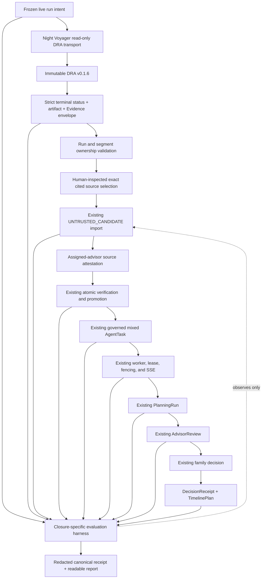

# Night Voyager Governed Live DRA Consumer Closure Design

## Status

**Implementation status:** PR A, PR B, and PR C are implemented provider-free; governed live acceptance remains pending.
Capability status remains `INCOMPLETE_PENDING_LIVE_ACCEPTANCE`.

This document defines the bounded Night Voyager consumer increment after the
`v0.1.3` local synthetic portfolio release. PR A implements only the offline
producer pin, migration, strict projection, deterministic scenario, fake transport,
and evaluation foundation. It does not authorize or claim provider execution,
governed live closure, release, or deployment.

The implementation is Night Voyager-owned. Decision Research Agent `v0.1.6` is an
immutable producer dependency. No DRA runtime, API, schema, release, or repository
change is required unless implementation discovers a new, evidenced producer
contract gap and the design is explicitly reopened.

## Summary

Night Voyager already provides:

- an offline deterministic DRA consumer fixture;
- strict canonical artifact validation;
- immutable `UNTRUSTED_CANDIDATE` import;
- assigned-advisor verification and source attestation;
- atomic Evidence promotion;
- governed mixed planning;
- durable task, worker, lease, event, and SSE authority;
- `AdvisorReview`, family decision, `DecisionReceipt`, and `TimelinePlan`;
- deterministic Skill evaluation and exact runtime pins.

DRA `v0.1.6` already publishes the producer side needed by a live consumer:

- immutable release and commit identity;
- the existing `dra.downstream-consumer.v1` compatibility projection;
- canonical artifact content, byte length, and SHA-256;
- persisted run-level Evidence;
- typed execution, review, and delivery state;
- idempotent run creation and bounded status/result APIs.

The current optional Night Voyager live proof stops after artifact validation. It
does not project live Evidence into a candidate, require source selection, import
the candidate, perform human promotion, or enter the existing mixed-planning
workflow.

This increment closes that gap without creating a second workflow or a generic
Agent platform. It also embeds a closure-specific evaluation harness so the final
proof evaluates both execution trajectory and authoritative database outcome rather
than reporting only one successful artifact fetch.

The governed path is:

```text
immutable DRA v0.1.6 live result
-> Night Voyager strict terminal Evidence projection
-> exact operator-inspected canonical source selection
-> existing UNTRUSTED_CANDIDATE import
-> explicit assigned-advisor source attestation
-> existing atomic verification and promotion
-> existing governed mixed PlanningRun
-> AdvisorReview
-> family decision
-> DecisionReceipt and TimelinePlan
```

DRA output remains untrusted input. DRA `accept_draft`, citation state,
verification state, acknowledgement, model output, trace, or artifact delivery does
not grant Night Voyager business authority.

## Inspected baseline

### Night Voyager

- The inspected Night Voyager baseline is clean
  `main@a487ee2805e6e744abce8120bfba6cb90f8df87b`, equal to `origin/main`.
- Annotated tag and GitHub Release `v0.1.3` identify the current local synthetic
  portfolio release.
- The migration graph is exactly `0001 -> ... -> 0009`, with `0009` as head.
- Migration `0005` owns the existing DRA candidate, verification, promotion, source
  pack, and external Evidence authority.
- Historical migration `0005` admits only the historical DRA `v0.1.3` producer
  identity. It must not be rewritten.
- The checked-in fixture is
  `fixtures/dra/downstream-consumer-contract-v1.json`.
- Its SHA-256 is
  `cc602576115ff9b41b0f07fa5f6ee88db15424760a78ab4611675e62e19a8157`.
- The current code pin remains DRA `v0.1.3` at commit
  `87b2a8e335385eb865086f7a69fe2b190567cfa2`.
- The existing read-only DRA adapter requests `/api/health`, while the DRA public
  contract exposes `/health`.
- The current live proof performs health, create, poll, result, artifact validation,
  temporary artifact handling, and a bounded result receipt. It stops before live
  candidate import.
- The existing offline governed proof already composes candidate import, source
  attestation, atomic promotion, mixed task creation, worker execution, SSE,
  advisor review, family decision, receipt, and timeline.
- Candidate import and promotion are exposed through the existing assigned-advisor
  HTTP authority. No new candidate or promotion endpoint is required.
- Required CI is provider-free and deterministic.

### Decision Research Agent

- The inspected DRA producer is clean
  `main@7d43324b469cb5e445c2e8be83af3be4d841cf1c`, equal to `origin/main`.
- Annotated release `v0.1.6` has tag object
  `9e0b0b443c435cf636dfce932c3c77d91d0a43e4` and peels to the inspected commit.
- DRA `v0.1.6` carries
  `docs/evidence/downstream-consumer-contract-v1.json` with the same exact
  SHA-256 as the Night Voyager fixture.
- The public request sequence is:
  `GET /health`, `POST /api/runs`, `GET /api/runs/{run_id}`, and
  `GET /api/runs/{run_id}/result`.
- A client polling timeout does not cancel the server run.
- DRA exposes no public run-cancellation endpoint.
- The terminal status payload includes run-level Evidence. The result endpoint
  provides canonical artifact content and identity.
- DRA runtime tracing and provider behaviour remain producer concerns. They do not
  become Night Voyager business ledgers.

## Problem

### The live proof stops before product authority begins

Artifact validation proves transport compatibility, not governed product
consumption. It does not prove that a live source can enter Night Voyager as an
untrusted candidate, pass explicit human authority, affect an exact promoted source
pack, and produce a durable family decision.

### A generic handoff artifact would duplicate authority

Publishing a second JSON or Markdown handoff format would create another contract
beside the existing DRA status/result APIs and Night Voyager candidate API. It would
also increase drift, retention, and privacy risk without adding business authority.

The existing transport and candidate contracts should be extended narrowly instead.

### Producer verification is not consumer authority

A cited or upstream-verified Evidence row may still be unsuitable for Night Voyager
business use. Source truth, applicant eligibility, intake availability, freshness,
redistribution constraints, and the exact business claim still require an assigned
advisor's explicit attestation.

### A single successful demo is not an Agent evaluation

The repository has extensive deterministic tests, but the live consumer proof does
not currently emit one correlated evaluation of:

- provider identity and terminal state;
- artifact and Evidence projection;
- candidate state;
- human gates;
- task, execution, event, Skill pin, and PlanningRun trajectory;
- advisor and family outcomes;
- privacy and cleanup.

A bounded evaluation harness is required, but it must remain specific to this
closure. It must not become a generic hosted evaluation platform.

### Remote cancellation is not available

The producer contract explicitly states that client timeout stops polling only.
Inventing a cancellation claim or silently starting a second run would make
recovery ambiguous and could consume provider budget twice.

Timeout recovery must retain the original `run_id` and reconcile that same run.
True remote cancellation would require a separate DRA API design and is outside
this increment.

## Decision and rejected alternatives

### Selected: Night Voyager-only governed closure with an integrated evaluation harness

Night Voyager will consume immutable DRA `v0.1.6`, project a strict terminal
snapshot, require exact source selection, reuse the existing candidate and human
promotion APIs, and reuse the existing mixed-planning and decision workflow.

A versioned, provider-free evaluation harness will be developed with the closure.
It will generate redacted stage receipts and verify trajectory plus database
outcome. It will not own business writes.

### Rejected: pin-only artifact proof

Updating the producer pin and validating one artifact would preserve the current
gap. It would not prove candidate import, human promotion, mixed planning, or family
decision authority.

### Rejected: public handoff artifact

A new DRA export file or public handoff schema would duplicate the existing
status/result contract and create unnecessary content-retention and versioning
surface.

### Rejected: new DRA endpoint

DRA already exposes the required artifact and Evidence. A new endpoint would not
improve Night Voyager's human authority chain.

### Rejected: standalone generic Eval and Trace platform first

A generic platform would repeat existing receipts, PostgreSQL authority, tests, and
proof infrastructure while delaying the product closure. Evaluation is therefore
bounded to the governed live DRA path.

### Rejected: LangGraph, OpenAI Agents SDK, A2A, or another orchestration runtime

Framework HITL and checkpointing govern Agent execution or tool calls, not
Night Voyager's assigned-advisor and family business records. A2A is unnecessary
for one exact-pinned producer with an existing frozen HTTP contract. Introducing
another runtime or protocol would create a second state machine without removing
existing authority.

### Rejected: automatic memory or Skill evolution

External output may propose a candidate but may not create durable facts, activate
Skills, promote Evidence, or decide for an advisor or family.

## Goals

1. Pin the live consumer to exact immutable DRA `v0.1.6` producer identity.
2. Preserve the existing `dra.downstream-consumer.v1` fixture schema and hash.
3. Keep historical DRA `v0.1.3` candidate rows readable and valid.
4. Admit new candidate imports only from exact DRA `v0.1.6`.
5. Correct the DRA health path to the public `/health` contract.
6. Parse the real DRA status and result shapes through strict, closed DTOs.
7. Validate Evidence ownership against the accepted `run_id` and `segment_id`
   before reducing it to the six-field consumer projection.
8. Preserve raw source URL identity without Pydantic or URL-library rewriting.
9. Require exactly one operator-selected Evidence row from the same run whose
   `citation_status` is `cited`, whose source is public HTTPS, and whose raw URL is
   byte-for-byte equal to the declared selection.
10. Import only the selected Evidence row into the existing candidate authority.
11. Preserve candidate status as `UNTRUSTED_CANDIDATE` until assigned-advisor
    verification.
12. Require an operator-supplied source snapshot and explicit assigned-advisor
    source attestation before promotion, with exact URL, byte-length, and SHA-256
    binding.
13. Reuse the existing atomic promotion, source-pack, mixed-planning, worker, SSE,
    review, family decision, receipt, and timeline authorities.
14. Make every provider-facing attempt bounded, one-shot, and separately authorized.
15. Preserve one frozen attempt identity and reconcile only the same DRA run after
    an ambiguous response or polling timeout.
16. Add versioned deterministic scenario manifests, canonical redacted receipts,
    trajectory assertions, database outcome assertions, and a closed failure
    taxonomy.
17. Keep required CI completely offline, deterministic, credential-free, and
    provider-free.
18. Produce a provider-free recovery bundle before any live acceptance.
19. Keep artifact and source-snapshot content ephemeral and out of durable receipts,
    logs, database rows, Git, and release artifacts; resumable promotion re-supplies
    the same snapshot identity instead of relying on process memory.
20. Prove cleanup and resource ownership before claiming a live acceptance.

## Non-goals

- No DRA runtime, API, schema, repository, release, prompt, model, or provider change.
- No DRA public cancellation endpoint.
- No automatic provider retry or second run after timeout.
- No automatic source selection, candidate promotion, advisor review, or family
  decision.
- No trust derived from DRA `accept_draft`, `verification_status`, citation state,
  model output, acknowledgement, or tracing.
- No new candidate, promotion, planning, review, receipt, or timeline workflow.
- No new browser route or required browser demo.
- No generic Agent evaluation service, dashboard, hosted trace store, or benchmark
  platform.
- No LangGraph, OpenAI Agents SDK, A2A, OpenClaw gateway, Mem0, Hermes, Temporal,
  Celery, Redis, message broker, or second orchestration dependency.
- No LangSmith or remote trace as required evidence or business authority.
- No raw chain-of-thought, provider envelope, prompt, secret, credential, cookie,
  token, local path, or traceback persistence.
- No artifact content or selected source bytes in durable evaluation receipts.
- No source-truth, provider-quality, provider-cost, admissions-outcome, production,
  HA, SLA, exactly-once, real-user, or business-impact claim.
- No release, deployment, or live-provider execution as part of implementation PRs.
- No change to the deterministic offline public demo's provider-free guarantee.

## Product invariants

1. **DRA is a producer, not Night Voyager authority.**
2. **Every live producer identity is immutable and exact.**
3. **External content is untrusted data, never executable instruction.**
4. **Terminal producer state is necessary but not sufficient for candidate import.**
5. **Evidence ownership is checked before consumer projection.**
6. **Raw source identity is preserved exactly.**
7. **Only one inspected cited Evidence URL enters the candidate; selection is not
   source attestation.**
8. **A candidate never self-promotes.**
9. **Only an assigned advisor may submit source attestation and promotion, using an
   operator-supplied snapshot bound exactly to the selected raw URL.**
10. **DRA verification state cannot substitute for advisor attestation.**
11. **Mixed planning reads only the exact promoted mapping.**
12. **Existing worker, lease, fencing, SSE, review, and family authorities remain
    unchanged.**
13. **Evaluation observes authority; it does not create authority.**
14. **Provider timeout does not imply remote cancellation.**
15. **Recovery continues the same attempt and same run.**
16. **Required CI never consumes provider budget or credentials.**
17. **Content lifetime is shorter than receipt lifetime.**
18. **Public claims follow merged code and retained proof, not design intent.**

## Architecture



## Producer identity and migration contract

### Exact producer identity

New live imports use:

```text
name: decision-research-agent
release: v0.1.6
commit: 7d43324b469cb5e445c2e8be83af3be4d841cf1c
tag_object: 9e0b0b443c435cf636dfce932c3c77d91d0a43e4
contract_schema: dra.downstream-consumer.v1
fixture_sha256: cc602576115ff9b41b0f07fa5f6ee88db15424760a78ab4611675e62e19a8157
profile_id: generic
```

The tag object belongs in proof and evaluation receipts. Candidate business identity
continues to persist release, commit, contract schema, fixture hash, request
identity, run identity, artifact identity, and Evidence projection.

### Migration `0010`

Implementation introduces a new migration after `0009`. Historical migration
`0005` remains byte-for-byte unchanged.

Migration `0010` must:

- preserve exact historical `v0.1.3` candidate rows;
- replace the old table constraint with a closed producer-tuple constraint that
  permits only the exact historical `v0.1.3` tuple or exact `v0.1.6` tuple;
- replace the runtime import function so new imports accept only exact `v0.1.6`;
- preserve existing RLS, grants, idempotency, immutability, candidate cardinality,
  and promotion authority;
- prevent mixed producer tuples;
- preserve all existing promoted rows and mappings;
- refuse downgrade while any `v0.1.6` candidate row exists;
- restore the historical `v0.1.3` constraint and function definition only when the
  downgrade precondition is satisfied;
- prove upgrade, downgrade, and re-upgrade function and privilege parity.

No implementation may update historical candidate rows from `v0.1.3` to `v0.1.6`.

## Strict transport and projection contracts

### Health and endpoint routing

The transport must use:

```text
GET /health
POST /api/runs
GET /api/runs/{run_id}
GET /api/runs/{run_id}/result
```

The existing `/api/health` path is incorrect and must become a provider-free RED
before it is fixed.

### Terminal state

Only this terminal state is eligible:

```text
execution_status = completed
review_status = not_required
delivery_status = ready
state_version > 0
profile_id = generic
failure_cause absent or null
```

Pending, running, failed, rejected, cancelled, incomplete, unknown, extra, malformed,
or contradictory state fails closed and cannot produce a candidate.

### Evidence input envelope

The live transport may parse upstream ownership fields only long enough to verify:

- Evidence belongs to the accepted `run_id`;
- Evidence belongs to the accepted `segment_id`;
- Evidence collection is non-empty and bounded;
- Evidence IDs are unique;
- no field has the wrong type;
- unknown fields do not enter the consumer projection.

Only after ownership validation may an Evidence row be reduced to:

```text
evidence_id
source_url
source_identity
retrieved_at
citation_status
verification_status
```

`verification_status` remains informational. It does not determine promotion.

### Raw URL identity

Consumer DTOs for live Evidence and source attestation must preserve the original
URL string. They must not store a normalized `HttpUrl` result as identity.

Validation must reject:

- non-HTTPS schemes;
- credentials;
- missing or private hosts;
- localhost, `.localhost`, `.local`, literal private/reserved IPs;
- traversal or malformed syntax;
- a `source_identity` that is not byte-for-byte equal to the raw URL;
- a selected URL that differs by case, trailing slash, encoding, query, fragment,
  default port, punycode, or any other normalization;
- multiple Evidence rows matching the selected raw URL;
- a selected row from another run or segment.

Validation may parse a temporary URL representation to inspect scheme and host, but
must compare and persist the original bounded string.

### Artifact contract

The canonical artifact remains:

```text
artifact_id = research-report.md
kind = research_report_markdown
media_type = text/markdown
1 <= byte_length <= 1 MiB
sha256 = SHA-256 of exact UTF-8 bytes
```

Artifact content may exist only in a task-owned, permission-restricted inspection
boundary. Durable candidate and evaluation records store identity, length, and hash,
not content.

## Human source-selection contract

After terminal projection, the proof operator must inspect the canonical artifact
and the bounded same-run Evidence inventory.

The operator explicitly declares one raw source URL. The controller accepts it only
when exactly one Evidence row:

- belongs to the accepted run and segment;
- has `citation_status = cited`;
- has a non-null public HTTPS source;
- has raw `source_url == source_identity`;
- has raw `source_url` byte-for-byte equal to the operator declaration.

Only that Evidence row enters the candidate import. Other upstream Evidence rows do
not become candidate rows, promoted Evidence, or persisted source records.

This Stage 1 selection chooses only the unique cited Evidence raw URL from the same
run and segment. It is not source attestation. Stage 1 does not accept, validate, or
persist source snapshot bytes, and it must not infer snapshot metadata from DRA
state, artifact prose, or Evidence metadata.

The proof operator is not a new Night Voyager identity role. Candidate import and
verification continue through an existing assigned-advisor session.

## Stage contracts

The logical controller has four separately resumable stages.

### Stage 1: capture-live

Responsibilities:

- load and freeze one versioned live run intent;
- resolve exact producer identity;
- create at most one DRA run attempt;
- poll within a bounded deadline;
- fetch and validate the terminal result;
- verify artifact bytes/hash;
- verify Evidence ownership and strict projection;
- support explicit human inspection and exact source selection;
- import one existing `UNTRUSTED_CANDIDATE`;
- delete canonical artifact content after the candidate import boundary;
- emit a redacted candidate receipt and provider-free recovery bundle.

It must not accept or persist source snapshot bytes, promote Evidence, create
planning work, submit review, or decide for a family.

### Stage 2: promote

Responsibilities:

- require an existing candidate receipt;
- re-read candidate authority;
- require an assigned-advisor session;
- require the operator to inspect and supply one task-owned,
  permission-restricted source snapshot plus explicit reason and the complete
  metadata required by the existing source-attestation contract;
- verify the same Evidence ID and exact raw URL selected in Stage 1;
- require the attestation `canonical_url` raw string to be byte-for-byte equal to
  the Stage 1 selected raw URL;
- reuse the existing safe snapshot validation with a declared root and
  traversal-free logical path, reject symlinks and root escape, read the exact
  bytes, and validate declared byte length, SHA-256, and bounded known gaps;
- call the existing atomic verification/promotion endpoint;
- emit a redacted promotion receipt.

It must not infer attestation metadata from DRA state, artifact prose, or Evidence
metadata, and it must not fetch the source remotely.

Snapshot bytes exist only within the Stage 2 validation and atomic-promotion
boundary. They are deleted on success, handled failure, interrupt, and explicit
cleanup. Durable receipts retain only exact URL identity, byte length, SHA-256, and
bounded attestation metadata. A missing snapshot or any URL, length, hash, path,
symlink, or escape mismatch fails closed before promotion and leaves no partial
promotion. Resuming Stage 2 requires the operator to re-supply the same snapshot
identity and bytes; recovery never depends on in-memory content or state.

### Stage 3: review

Responsibilities:

- create the existing governed mixed-planning task with exact promoted pack and
  active Skill pin;
- observe durable task, execution, event, SSE, and PlanningRun state;
- require explicit assigned-advisor review through the existing route;
- emit a redacted review receipt.

It must not create a second planning workflow.

### Stage 4: decide

Responsibilities:

- require the existing parent/family authority;
- submit the existing family decision;
- verify `DecisionReceipt` and `TimelinePlan`;
- emit the final redacted evaluation report.

It must not claim real admissions outcome or production use.

Acknowledging or invoking a stage authorizes only that stage command. It never grants
candidate, promotion, review, or family business authority.

## Run intent, idempotency, and reconciliation

### Frozen live intent

Before provider execution, the controller freezes a canonical intent containing:

```text
schema_version
scenario_id
attempt_id
producer identity
profile_id
bounded query or request identity
request_sha256
deadline policy
poll interval
expected terminal contract
privacy policy
receipt schema version
```

`attempt_id` is generated once and retained. The canonical intent hash is the root
identity for all stage receipts.

### Domain-separated keys

Each mutation uses a deterministic, domain-separated idempotency key derived from:

```text
intent_sha256
stage name
target business identity
```

DRA create, candidate import, promotion, task creation, advisor review, and family
decision do not share an undifferentiated key.

### Ambiguous create

If run creation returns an ambiguous transport result before `run_id` is observed:

- do not create a new attempt;
- do not generate a new idempotency key;
- record a bounded reconciliation-required receipt;
- stop automatic execution;
- require separate authorization to replay the exact create request with the same
  intent and same key.

An exact idempotent replay is reconciliation of one attempt, not a second provider
run.

### Polling timeout and late result

If polling reaches its deadline:

- record `run_id`, last accepted state version, deadline, and failure phase;
- mark the provider attempt consumed;
- stop polling;
- do not claim cancellation;
- do not create another run;
- do not import a candidate.

A later authorized recovery may poll the same `run_id`. If it reaches a valid
terminal state, the same frozen intent continues. If identity or state conflicts,
the attempt remains failed closed.

### Stage replay

Every provider-free stage re-reads authoritative state before mutation.

- Exact same request returns existing idempotent result.
- Same key with different payload fails closed.
- A downstream receipt cannot exist without its parent receipt.
- A recovered process must not rely on in-memory state.
- Reconciliation never changes producer, candidate, selected Evidence, Case,
  advisor, Skill pin, or promoted pack identity.

## Closure-specific evaluation harness

The evaluation harness is part of the capability, not a separate platform.

### Inputs

- versioned deterministic scenario manifest;
- frozen live run intent;
- redacted stage receipts;
- exact database projections;
- task, execution, event, Skill pin, PlanningRun, review, receipt, and timeline
  identities;
- explicit expected non-claims.

### Trajectory assertions

The harness verifies:

- one producer attempt identity;
- exact producer pin;
- valid terminal transition;
- exact artifact identity and hash;
- Evidence ownership and selection;
- candidate imported before promotion;
- candidate remained untrusted until explicit advisor action;
- promotion actor and selected Evidence identity;
- promoted source-pack identity;
- exact task operation and Skill pin;
- task, execution, event, SSE, and PlanningRun correlation;
- explicit `AdvisorReview`;
- explicit family decision;
- receipt and timeline correlation;
- no automatic promotion or decision;
- no second provider run.

### Outcome assertions

The harness verifies authoritative PostgreSQL outcomes:

- exactly one candidate for the live import identity;
- exactly one terminal verification decision;
- exact promoted source-pack mapping;
- exact external claim:
  `australia_program_fit`;
- exact Evidence role:
  `program_fit`;
- exact authority:
  `externally_verified`;
- one governed mixed task using the promoted pack;
- expected durable task and PlanningRun terminal state;
- one advisor review;
- one family decision;
- one `DecisionReceipt`;
- one `TimelinePlan`;
- tenant and actor isolation;
- no partial row set after injected failures.

### Report formats

The harness emits:

1. canonical redacted JSON for machine verification;
2. a human-readable report for code review and public proof.

Reports may include:

- schema and scenario versions;
- producer release, commit, tag object, fixture hash;
- intent, request, artifact, source snapshot, candidate, task, result, and receipt
  hashes;
- IDs that are already synthetic and public-safe;
- stage state, duration, failure phase, and assertion results;
- cleanup and inventory results;
- non-claims.

Reports must not contain:

- artifact content;
- source bytes;
- provider prompts or raw responses;
- chain-of-thought;
- credentials, cookies, tokens, headers, or environment values;
- private paths;
- raw exception bodies or tracebacks;
- real personal data.

### Evaluation boundary

A successful live acceptance proves one bounded integration execution. It does not
prove statistical provider quality, source truth, accuracy, cost stability,
production reliability, SLA, or real-user outcome.

## Failure taxonomy

The controller exposes a closed public-neutral phase taxonomy:

```text
preflight_invalid
producer_identity_invalid
producer_unavailable
run_acceptance_ambiguous
run_poll_deadline_exhausted
terminal_state_invalid
artifact_contract_invalid
evidence_ownership_invalid
evidence_projection_invalid
source_selection_invalid
candidate_import_conflict
candidate_authority_denied
source_attestation_invalid
promotion_conflict
planning_task_conflict
planning_execution_failed
advisor_review_conflict
family_decision_conflict
outcome_projection_invalid
cleanup_incomplete
```

Each failure receipt contains only:

- phase;
- bounded public code;
- retryability classification;
- whether the provider attempt was consumed;
- known durable identities;
- last completed receipt;
- permitted next action.

Raw upstream errors, URLs containing secrets, response bodies, SQLSTATE values,
tracebacks, or filesystem paths do not enter the public receipt.

## Privacy, security, and cleanup

- Credentials remain outside Git and outside receipts.
- Provider credentials are used only by the producer runtime.
- Night Voyager receives only the minimum transport authorization needed by the
  existing loopback proof.
- Artifact inspection and operator-supplied source snapshot files use task-owned
  private temporary paths and restrictive permissions.
- Stage 1 deletes artifact content after candidate import. Stage 2 deletes source
  snapshot bytes on success, handled failure, interrupt, and explicit cleanup.
- Recovery bundles retain URL, length, hash, and bounded identities, never content;
  Stage 2 recovery requires re-supplying the same snapshot identity.
- External text is treated as data and never interpreted as instruction.
- Existing Origin, CSRF, session, idempotency, tenant, role, and RLS boundaries
  remain required.
- Candidate import, promotion, task creation, review, and family decision continue
  through existing narrow HTTP and PostgreSQL authority.
- No live content is copied into deterministic fixtures automatically.
- Any evidence-only repository change after live acceptance must be separately
  reviewed for redistribution, privacy, and public-claim safety.

## Testing strategy

### Required provider-free tests

Required CI uses deterministic fake transport and checked-in fixtures only.

Transport and DTO tests cover:

- `/health` path;
- request method and endpoint sequence;
- exact producer identity;
- terminal and non-terminal states;
- missing, extra, malformed, duplicate, or reordered Evidence;
- wrong run or segment ownership;
- artifact size, byte length, encoding, and hash;
- raw URL normalization counterexamples;
- private, credentialed, non-HTTPS, malformed, or ambiguous URLs;
- zero, one, and multiple selected-source matches;
- DRA verification state not granting authority.

Migration and database tests cover:

- `0009 -> 0010`;
- historical `v0.1.3` row preservation;
- exact `v0.1.6` admission;
- mixed producer tuple rejection;
- new-import rejection for `v0.1.3`;
- downgrade refusal with `v0.1.6` rows;
- successful downgrade without them;
- re-upgrade parity;
- grants, RLS, immutability, idempotency, rollback, and cardinality.

Controller and recovery tests cover:

- one frozen attempt;
- ambiguous create;
- same-key replay;
- same-key conflict;
- deadline and same-run late reconciliation;
- crash after each stage;
- missing or forged receipt;
- wrong candidate, Case, actor, Evidence, pack, or Skill identity;
- no artifact or source content in receipts;
- Stage 1 accepts no source snapshot and deletes artifact content after import;
- Stage 2 restart requires re-supplying the same snapshot identity and bytes;
- cleanup after success and failure.

Authority and end-to-end tests cover:

- candidate remains untrusted;
- wrong actor and cross-tenant denial;
- assigned-advisor attestation;
- explicit operator inspection and snapshot supply before attestation;
- DRA state cannot promote;
- operator-supplied snapshot with exact selected raw URL, byte-length, and SHA-256
  binding;
- declared-root and traversal-free logical-path enforcement, including symlink,
  root-escape, missing snapshot, URL, length, and hash rejection with no partial
  promotion;
- no automatic source fetch or attestation inference from DRA, artifact, or Evidence;
- atomic promotion;
- governed mixed task;
- task/execution/event/SSE/PlanningRun correlation;
- advisor review;
- family decision;
- receipt and timeline;
- injected rollback boundaries;
- trajectory and database outcome evaluator.

### Required commands

The implementation plan must bind the new tests into existing project gates,
including:

```text
uv lock --check
Ruff
Pyright
focused DRA consumer checks
focused database migration and authority checks
make dra-check
make check
make proof
make compose-proof
make down
release verifier in development mode
git diff --check
public-hygiene and private-path scans
```

Exact command and node lists are implementation-plan decisions and must reflect the
actual repository after each PR.

### Live tests

Live provider execution is never a required CI gate. It is separately authorized
only after candidate freeze.

## Docker and Compose governance

Every PR and live acceptance that uses Docker must record before and after:

- host filesystem available space;
- Docker Desktop VM filesystem available space;
- Compose project inventory;
- container inventory;
- image and BuildKit cache inventory;
- network inventory;
- volume inventory.

Heavy gates require the existing default Docker VM minimum of
`8,388,608 KiB` without an override.

Task-owned resources must use a unique Compose project name and be removed through
the existing teardown path.

Retained resources may include:

- `night-voyager_postgres-data`;
- shared base and proof images;
- shared BuildKit cache.

The task must not delete or mutate retained resources.

Broad prune, deletion of non-task images or volumes, Docker Desktop or daemon
configuration, BuildKit policy changes, disk expansion, or global reset requires
separate explicit authorization and is not implied by this design.

Build reuse is preferred when identity is unchanged. A network failure does not
authorize repeated cold builds, source changes, proxy persistence, or broad cleanup.

## Delivery topology

The implementation is delivered as three sequential pull requests.

No top-level PR runs in parallel because producer pinning, migration authority,
transport DTOs, controller receipts, and downstream proof share one authority chain.
Bounded internal lanes are allowed only when the implementation plan demonstrates
independent files and tests with no shared migration, contract, or integration
ownership.

### PR A: producer pin, strict projection, and evaluation foundation

PR A owns:

- DRA `v0.1.6` producer identity;
- migration `0010`;
- `/health` transport correction;
- real status/result DTOs;
- Evidence ownership validation;
- raw exact URL validation for Evidence and source attestation;
- deterministic scenario manifest;
- fake transport;
- evaluation receipt schemas and pure evaluators;
- migration, contract, security, release, and documentation updates.

PR A performs no provider call and no live candidate import.

Exit evidence:

- historical rows preserved;
- only exact new producer admitted;
- transport and projection tests fail closed;
- evaluator is deterministic;
- migration downgrade rules proven;
- complete gates GREEN;
- clean worktree and reviewable local branch.

Rollback:

- revert PR A before any live `v0.1.6` candidate exists;
- or downgrade only when migration preconditions allow it.

### PR B: live capture, candidate import, and recovery bundle

PR B owns:

- frozen live intent schema;
- stage receipts;
- domain-separated idempotency;
- bounded capture controller;
- exact human source selection;
- existing candidate import composition;
- ambiguous-create and same-run late reconciliation;
- provider-free recovery bundle;
- privacy and cleanup proof;
- focused operations and reference documentation.

PR B required tests remain fake and provider-free. PR B performs no live provider
call during implementation or CI.

Exit evidence:

- one-attempt semantics;
- no remote cancellation claim;
- timeout cannot create a second run;
- candidate remains untrusted;
- content-free receipts;
- recovery after each injected stop;
- complete gates GREEN;
- clean worktree and reviewable local branch.

Rollback:

- revert PR B without affecting historical candidates or promotion authority;
- any test candidate remains governed by existing candidate lifecycle.

### PR C: human promotion, mixed planning, and final evaluation

PR C owns:

- explicit source-attestation stage composition;
- existing atomic promotion composition;
- governed mixed task, worker, SSE, and PlanningRun composition;
- `AdvisorReview`;
- family decision, `DecisionReceipt`, and `TimelinePlan`;
- trajectory plus database outcome report;
- final offline end-to-end fixture;
- live acceptance controller documentation;
- candidate-freeze checklist.

PR C performs no live provider call during implementation or CI.

Exit evidence:

- full deterministic fixture closure;
- wrong-role, cross-tenant, conflict, rollback, late-result, and cleanup cases;
- exact trajectory and outcome report;
- complete required CI and Compose proof GREEN;
- authority review CLEAN;
- exact merged-main candidate freeze.

Rollback:

- revert PR C without modifying the producer, historical candidate records, or
  existing standalone offline governed flow.

## Candidate freeze and one-shot live acceptance

A live provider attempt is permitted only after:

1. PR A, PR B, and PR C are merged.
2. Local, remote, and live `main` identify one exact commit.
3. Required hosted checks are GREEN on that commit.
4. Independent authority review is CLEAN.
5. Provider-free recovery bundle is GREEN.
6. Exact producer, intent, scenario, receipt, selected-source, privacy, and cleanup
   schemas are frozen.
7. Docker host and VM preflight is GREEN.
8. Task-owned project and retained-resource inventory is recorded.
9. The exact operator source-inspection, snapshot-supply, validation, and cleanup
   procedure is frozen.
10. The user explicitly authorizes one frozen live attempt.

The live acceptance uses:

- one manifest;
- one `attempt_id`;
- one run intent;
- no automatic retry;
- no second provider run;
- one selected source;
- one operator-supplied source snapshot bound to the selected raw URL;
- explicit assigned-advisor attestation;
- provider-free downstream stages after candidate capture.

If the provider-facing stage fails, the controller records the stable failure phase
and stops. If the same terminal lane encounters a second substantive failure after
a targeted repair, execution stops for investigation rather than continuing small
provider-consuming changes.

After a successful live acceptance, any evidence-only repository change requires
separate review and authorization. It must not include artifact content or
link-only source bytes.

## Documentation impact

Implementation must evaluate and, where needed, update in the relevant PR:

- ADR for the live consumer and evaluation boundary;
- DRA consumer operations;
- DRA governed Evidence reference;
- HTTP API reference if request projections change;
- database roles and migration operations;
- proof routing and release verification;
- public design and plan status;
- README or portfolio claims only after merged proof supports them.

Historical release documents and published source-archive verification guides remain
immutable.

No document may claim production deployment, real students, live institutional
coverage, admissions outcomes, provider quality, source truth, statistical
stability, SLA, HA, or exactly-once execution.

## Acceptance criteria

The capability is complete only when:

- exact DRA `v0.1.6` identity is enforced for new imports;
- historical `v0.1.3` rows remain valid;
- real DRA status and result shapes are strictly projected;
- `/health` is correct;
- Evidence ownership is proven before projection;
- raw source URL identity is preserved and exact;
- exactly one inspected cited Evidence URL enters the candidate, without treating
  selection as source attestation;
- candidate import remains untrusted;
- assigned-advisor source attestation is explicit and uses an operator-supplied
  snapshot whose raw canonical URL, byte length, and SHA-256 match the Stage 1
  selection and declared snapshot;
- promotion is atomic and exact;
- existing mixed planning, worker, SSE, review, family decision, receipt, and timeline
  complete without a second workflow;
- trajectory and PostgreSQL outcome evaluators agree;
- required CI remains offline and provider-free;
- recovery never creates a second run;
- artifact and source snapshot content is absent from durable receipts, cleaned from
  its stage-owned temporary boundary, and re-supplied by exact identity for recovery;
- Docker and Compose ownership and teardown are proven;
- implementation PRs, authority review, hosted CI, and merged-main freeze are complete;
- one separately authorized, frozen live acceptance succeeds through the complete
  governed closure;
- public claims and non-claims match the retained evidence.

A bounded retained failure receipt proves only that one attempt stopped safely and
that its diagnostics, content cleanup, and resource cleanup are effective. It is
valid stop evidence, but the capability remains incomplete and blocked; it does not
authorize a success claim or a public governed-live-closure claim. The existing rule
still applies: after a second substantive failure in the same terminal lane following
a targeted repair, stop and investigate rather than consuming another provider
attempt.

## Remaining boundaries

Even after a successful one-shot live acceptance, Night Voyager remains a local
synthetic portfolio unless separately deployed and verified.

The capability does not prove:

- real student or advisor usage;
- real school coverage;
- admissions outcomes;
- source correctness;
- provider quality or cost stability;
- statistical Agent reliability;
- production security or availability;
- distributed HA, SLA, or exactly-once execution.

Those remain separate future decisions, not implied follow-up work.
